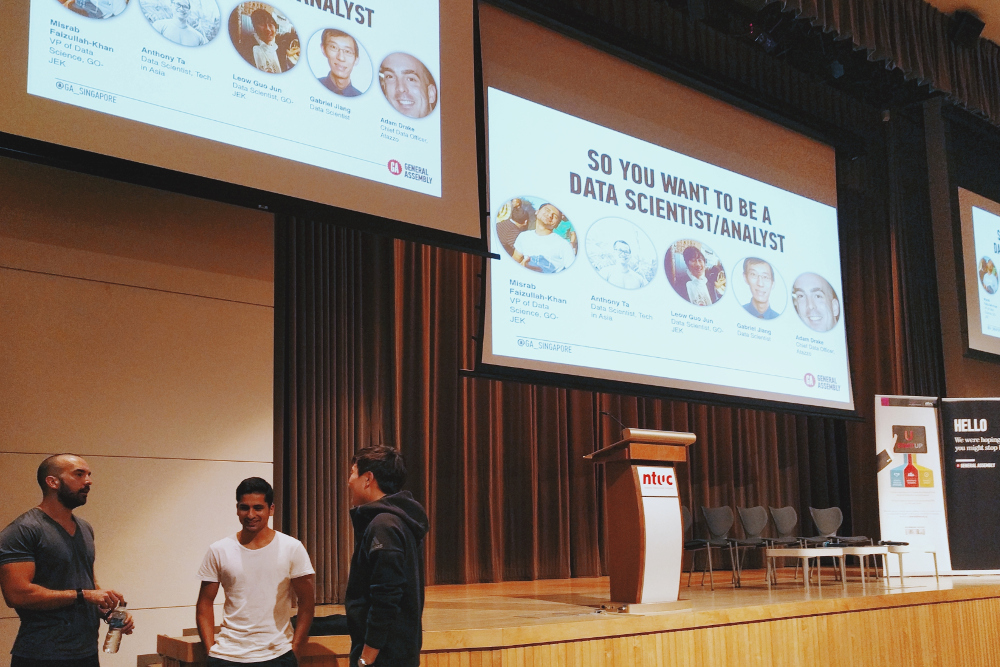

I recently attended a panel discussion hosted by General Assembly in Singapore entitled, "So you want to be a Data Scientist/Analyst". The panel featured professionals in different stages of their careers and offered a wealth of information to an audience of hopefuls, including tips on how to land a job as a data scientist, and stories debunking myths that color this field.

## The panelists

- **Misrab Faizullah-Khan** - VP of Data Science, _GO\_JEK_
- **Anthony Ta** - Data Scientist, _Tech in Asia_
- **Leow Guo Jun** - Data Scientist, _GO\_JEK_
- **Gabriel Jiang** - Data Scientist
- **Adam Drake** - Chief Data Officer, _Atazzo_

Here's a rundown of the major points discussed, paraphrased for brevity.

### What's a day-in-the-life like

We're mostly "data janitors." A large part of working with data begins with and consists of data sanitation. Without quality data, you won't get accurate results. Understanding how data should be sanitized largely encompasses skills that aren't directly related to data analytics. To fully understand the problem you're hoping to solve, you need to talk with the people involved. It's important that everyone understands all the elements of a project, and exactly what those elements are being called. "Sales," as an example, may be calculated differently depending on who you're talking to.

### What's a data "scientist" vs. data "analyst"

It largely depends on the company you work for. "Data [insert modifier]" is only a recent distinction for a job field that has historically been called "Business Analytics." In a smaller company, as with any other position, one person may handle a variety of data-related tasks under the title of "Data Scientist." In a larger company with more staff and finer grain specialization, you may have a "Data Analyst" that handles less technical aspects, and a "Data Scientist" whose work is very technical and involves quantitative learning or machine learning.

The field of data science/analytics is fresh enough that standard definitions for job titles really haven't been agreed upon yet. When considering a position, focus on the company rather than the title.

### Should I join a startup or large company

There's no wrong answer. Being aware of your own working style and preferences will help guide your decision.

Startups generally offer more freedom and less micromanaging. This also means that you'll necessarily receive less guidance, and will need to be able to figure stuff out, learn, and make progress under your own power.

In a big company, you're likely to experience more structure, and be expected to follow very clearly defined pre-existing processes. Your job scope will likely be more focused than it would be at a startup. You'll experience less freedom in general, but also more certainty in what's expected of you.

In the end, especially at the beginning of your career, don't put too much stock in choosing one or the other. If you like the company, big or small, give it a try. If you're not happy there after a few months, then try another one. No career decision is ever permanent.

It's also worthwhile to note that even if you find a company you like the first time around, it's in your best interest to change companies after one or two years. The majority of the salary raises you'll earn in your lifetime will occur in the first ten years of your career. Say you're hired by Company A as a junior data scientist for two years - after two years, you're no longer a junior. You can now earn, say, a 30% higher salary in a data scientist position, but it's unlikely that Company A will give you a 30% raise after two years. At that point it's time to find Company B and put a few more years of experience on your resume, then probably change companies again. You don't earn the big bucks sticking with one company for decades - you'll always be the junior developer.

### What do you look for when hiring a candidate

Overall, the most important skills for a data science candidate are soft skills. Curiosity, tenacity, and good communication skills are vital. Persistence, especially when it comes to adapting to a quickly changing industry, is important. The most promising candidates are passionate enough about the field to be learning everything they can, even outside of their work scope. Hard skills like coding and algorithms can be taught - it's the soft skills that set good candidates apart.

Hacking skills are also vital. This doesn't necessarily mean you can write code. Someone who has a grasp of overall concepts, knows algorithms, and has curiosity enough to continuously learn is going to go farther than someone who can just write code. It takes creativity to build hacking skills on top of being familiar with the basic navigation points. Having the ability to come up with solutions that use available tools in new ways - that's hacking skill.

Design thinking is another important asset. Being able to understand how systems integrate on both technical and business levels is very valuable. If you're able to see the big picture, you're more likely to find different ways to accomplish the overall objective.

You might think that seeing buzzwords on resumes makes you look more attractive as a candidate - more often, it stands out as a red flag. Putting "advanced machine learning" on your CV and then demonstrating that you don't know basic algorithms doesn't look good. It's your projects and your interests outside of the job you're applying for that say the most about you. Popular topics in this industry change fast - you're better off having a solid grasp of basic fundamentals as well as a broad array of experience than name-dropping whatever's trending.

### Is there a future for humans in the data science field? When will the machines replace us

This isn't a question unique to data science, and many historical examples already exist. Financial investment is a good example - where you used to have a human do calculations and make predictions, computers now do a lot of that automatically, making decisions about risk and possible payoff every day.

Where humans won't be replaced, just as in other industries that have embraced automation, is in the human element. You'll still need people to handle communication, be creative, be curious, make interpretations and understand problems... all those things are fundamentally human aspects of enterprise.

Ultimately, machines and more automation will make human work less of a grind. By automating the mundane stuff, like data sanitization for example, human minds are freed up to develop more interesting things.

### What are the future applications for data-driven automation

Legal is a good next candidate for automation. There's a lot there that can be handled by programs using data to assess risk.

Medicine is another field ripe for advances through data. Radiologists, your days are numbered: image detection is coming for you. The whole field of diagnostics is about to drastically change.

A particularly interesting recent application for data science is in language translation. By looking at similarities in sentence structure and colloquial speech across different languages, we're able to sort similar words based on the "space" they occupy within the language structure.

Insurance - the original data science industry - already is and will continue to become very automated. With increased ability to use data to assess risk, we're beginning to see new creative insurance products being introduced. E-commerce companies can now buy insurance on the risk a customer will return a product - hard to do without the accessibility of data that we have today.

### How do I push data-driven decisions and get my boss to agree with me

It's a loaded question. The bottom line is that it depends on the company's data culture and decision path. We've experienced working for management who say, "We've already made the decisions, we just need the data to prove it." Obviously, that's a tough position to work from.

Generally, ask yourself, "Am I making my boss look good?" You might hear that and think, "Why would I let my boss get all the credit?" - but who cares? Let them take the credit. If you're producing good work, you're making your team look good. If you make your team look good, you're indispensible to your team and your boss. People who are indispensible are listened to.

### What's your best advice for a budding data scientist

Don't be too keen to define yourself too quickly. If you narrow your focus too much, especially when you're learning, you can get stuck in a situation of having become an expert in "Technology A, version 3" when companies are looking to hire for experts in version 4. It happens.

A broad understanding of fundamentals will be far more valuable to you on the whole. Maybe you start out writing code, and decide you don't like it, but discover that you're really good at designing big picture stuff and leading teams, and you end up as a technical lead. It could even vary depending on the company you work for - so stay flexible.

Your best bet is to follow what you're passionate about, and try to understand a wide range of overall concepts. Spend the majority of your efforts learning things that are timeless, like the base technologies under hot-topic items like TensorFlow. Arm yourself with a broad understanding of the terrain, different companies, and the products that are out there.

If you focus on learning code specifically, learning one language well makes it easier to learn others. Make sure you understand the basics.

### TL;dr it

- **Adam:** Talk more and don't give up.
- **Anthony:** [Be] courageous, and hands-on.
- **Gabriel:** Be creative.
- **Guo Jun:** It's worth the pain.
- **Misrab:** Evaluate yourself and maintain a feedback loop.

