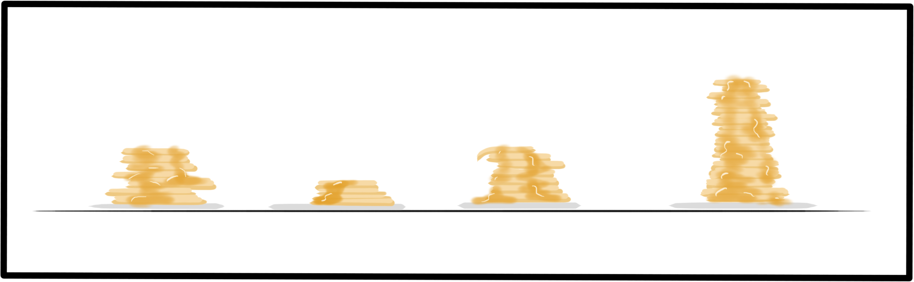

Here's ~~some complaining~~ a quick overview of some code that has confounded me more than once. I'm told even very experienced developers encounter these situations regularly, so if you find yourself on your third cup of coffee scratching your head over why your code is doing exactly what you told it to do (and not what you *want* it to do), maybe this post can help you.

The example code is JavaScript, since that's what I've been working in lately, but I believe the concepts to be pretty universal.

## Quick reference for equivalent statements

| This...       | ...is the same as this |
| ------------- | ---------------------- |
| `i++;`        | `i = i + 1;`           |
| `i--;`        | `i = i - 1;`           |
| `apples += 5` | `apples = apples + 5;` |
| `apples -= 5` | `apples = apples - 5;` |
| `apples *= 5` | `apples = apples * 5;` |
| `apples /= 5` | `apples = apples / 5;` |

## Quick reference for logical statements

| This...      | ...gives this                                   |
| ------------ | ----------------------------------------------- |
| `3 == '3'`   | `true` (type converted)                         |
| `3 === '3'`  | `false` (type matters; integer is not a string) |
| `3 != '3'`   | `false` (type converted, 3: 3)                  |
| `3 !== '3'`  | `true` (type matters; integer is not a string)  |
| &#124;&#124; | logical "or": either side evaluated             |
| `&&`         | logical "and": both sides evaluated             |

## Objects

Given a breakfast object that looks like this:

```js
var breakfast = {
    'eggs': 2,
    'waffles': 2,
    'fruit': {
        'blueberries': 5,
        'strawberries': 1,
    },
    'coffee': 1
}
```

Or like this:


### Iterate over object properties

We can iterate through each breakfast item using a for loop as follows:

```js
for (item in breakfast) {
    console.log('item: ', item);
}
```

This produces:

```sh
item: eggs
item: waffles
item: fruit
item: coffee
```

### Get object property value

We can access the value of the property or nested properties (in this example, the number of items) like this:

```js
console.log('How many waffles? ', breakfast['waffles'])
console.log('How many strawberries? ', breakfast['fruit']['strawberries'])
```

Or equivalent syntax:

```js
console.log('How many waffles? ', breakfast.waffles)
console.log('How many strawberries? ', breakfast.fruit.strawberries)
```

This produces:

```sh
How many waffles?  2
How many strawberries?  1
```

### Get object property from the value

If instead I want to access the property via the value, for example, to find out which items are served in twos, I can do so by iterating like this:

```js
for (item in breakfast) {
    if (breakfast[item] == 2) {
        console.log('Two of: ', item);
    }
}
```

Which gives us:

```sh
Two of:  eggs
Two of:  waffles
```

### Alter nested property values

Say I want to increase the number of fruits in breakfast, because sugar is bad for me and I like things that are bad for me. I can do that like this:

```js
var fruits = breakfast['fruit'];
for (f in fruits) {
    fruits[f] += 1;
}
console.log(fruits);
```

Which gives us:

```sh
{ blueberries: 6, strawberries: 2 }
```

## Arrays

Given an array of waffles that looks like this:

```js
var wafflesIAte = [ 1, 3, 2, 0, 5, 2, 11 ];
```

Or like this:



### Iterate through array items

We can iterate through each item in the array using a for loop:

```js
for (var i = 0; i < wafflesIAte.length; i++) {
    console.log('array index: ', i);
    console.log('item from array: ', wafflesIAte[i]);
}
```

This produces:

```sh
array index:  0
item from array:  1
array index:  1
item from array:  3
array index:  2
item from array:  2
array index:  3
item from array:  0
array index:  4
item from array:  5
array index:  5
item from array:  2
array index:  6
item from array:  11
```

Some things to remember:
`i` in the above context is a placeholder; we could substitute anything we like (`x`, `n`, `underpants`, etc). It simply denotes each instance of the iteration.

`i < wafflesIAte.length` tells our for loop to continue as long as `i` is less than the array's length (in this case, 7).

`i++` is equivalent to `i+1` and means we're incrementing through our array by one each time. We could also use `i+2` to proceed with every other item in the array, for example.

### Access array item by index

We can specify an item in the array using the array index, written as `wafflesIAte[i]` where `i` is any index of the array. This gives the item at that location.

Array index always starts with `0`, which is accessed with `wafflesIAte[0]`. Using `wafflesIAte[1]` gives us the second item in the array, which is "3".

### Ways to get mixed up over arrays

Remember that `wafflesIAte.length` and the index of the last item in the array are different. The former is 7, the latter is `6`.

When incrementing `i`, remember that `[i+1]` and `[i]+1` are different:

```js
console.log('[i+1] gives next array index: ', wafflesIAte[0+1]);
console.log('[i]+1 gives index value + 1: ', wafflesIAte[0]+1);
```

Produces:

```sh
[i+1] gives next array index:  3
[i]+1 gives index value + 1:  2
```

## Practice makes... better

The more often you code and correct your errors, the better you'll remember it next time!

That's all for now. If you have a correction, best practice, or another common error for me to add, please let me know!
