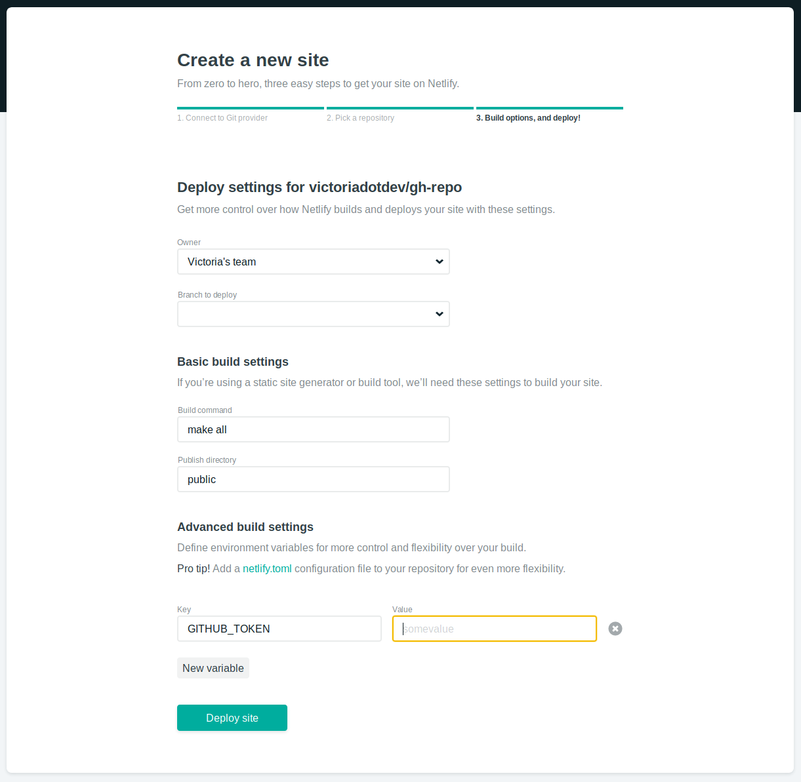

Tools like Travis CI and Netlify offer some pretty nifty features, like seamlessly deploying your GitHub Pages site when changes are pushed to its repository. Along with a static site generator like Hugo, keeping a blog up to date is pretty painless.

I've used Hugo to build my site for years, but until this past week I'd never hooked up my Pages repository to any deployment service. Why? Because using a tool that built my site before deploying it seemed to require having the whole recipe in one place - and if you're using GitHub Pages with the free version of GitHub, [that place is public](https://docs.github.com/en/pages/getting-started-with-github-pages/changing-the-visibility-of-your-github-pages-site). That means that all my three-in-the-morning bright ideas and messy unfinished (and unfunny) drafts would be publicly available - and no amount of continuous convenience was going to convince me to do that.

So I kept things separated, with Hugo's messy behind-the-scenes stuff in a local Git repository, and the generated `public/` folder pushing to my GitHub Pages remote repository. Each time I wanted to deploy my site, I'd have to get on my laptop and `hugo` to build my site, then `cd public/ && git add . && git commit`... etc etc. And all was well, except for the nagging feeling that there was a better way to do this.

I wrote another article a little while back about [using GitHub and Working Copy](/blog/a-remote-sync-solution-for-ios-and-linux-git-and-working-copy/) to make changes to my repositories on my iPad whenever I'm out and about. It seemed off to me that I could do everything except deploy my site from my iPad, so I set out to change that.

A couple three-in-the-morning bright ideas and a revoked access token later (oops), I now have not one but _two_ ways to deploy to my public GitHub Pages repository from an entirely separated, private GitHub repository. In this post, I'll take you through achieving this with [Travis CI](https://travis-ci.com/) or using [Netlify](http://netlify.com/) and [Make](https://www.gnu.org/software/make/).

There's nothing hackish about it - my public GitHub Pages repository still looks the same as it does when I pushed to it locally from my terminal. Only now, I'm able to take advantage of a couple great deployment tools to have the site update whenever I push to my private repo, whether I'm on my laptop or out and about with my iPad.



This article assumes you have working knowledge of Git and GitHub Pages. If not, you may like to spin off some browser tabs from my articles on [using GitHub and Working Copy](/blog/a-remote-sync-solution-for-ios-and-linux-git-and-working-copy/) and [building a site with Hugo and GitHub Pages](/blog/how-i-ditched-wordpress-and-set-up-my-custom-domain-https-site-for-almost-free/) first.

Let's do it!

## Private-to-public GitHub Pages deployment with Travis CI

Travis CI has the built-in ability (♪) to [deploy to GitHub Pages](https://docs.travis-ci.com/user/deployment/pages/) following a successful build. They do a decent job in the docs of explaining how to add this feature, especially if you've used Travis CI before... which I haven't. Don't worry, I did the bulk of the figuring-things-out for you.

* Travis CI gets all its instructions from a configuration file in the root of your repository called `.travis.yml`
* You need to provide a [GitHub personal access token](https://docs.github.com/en/authentication/keeping-your-account-and-data-secure/creating-a-personal-access-token) as a secure encrypted variable, which you can generate using `travis` on the command line
* Once your script successfully finishes doing what you've told it to do (not necessarily what you _want_ it to do but that's a whole other blog post), Travis will deploy your build directory to a repository you can specify with the `repo` configuration variable.

### Setting up the Travis configuration file

Create a new configuration file for Travis with the filename `.travis.yml` (note the leading "."). These scripts are very customizable and I struggled to find a relevant example to use as a starting point - luckily, you don't have that problem!

Here's my basic `.travis.yml`:

```yml
git:
  depth: false

env:
  global:
    - HUGO_VERSION="0.54.0"
  matrix:
    - YOUR_ENCRYPTED_VARIABLE

install:
  - wget -q https://github.com/gohugoio/hugo/releases/download/v${HUGO_VERSION}/hugo_${HUGO_VERSION}_Linux-64bit.tar.gz
  - tar xf hugo_${HUGO_VERSION}_Linux-64bit.tar.gz
  - mv hugo ~/bin/

script:
  - hugo --gc --minify

deploy:
  provider: pages
  skip-cleanup: true
  github-token: $GITHUB_TOKEN
  keep-history: true
  local-dir: public
  repo: gh-username/gh-username.github.io
  target-branch: master
  verbose: true
  on:
    branch: master
```

This script downloads and installs Hugo, builds the site with the garbage collection and minify [flags](https://gohugo.io/commands/hugo/#synopsis), then deploys the `public/` directory to the specified `repo` - in this example, your public GitHub Pages repository. You can read about each of the `deploy` configuration options [here](https://docs.travis-ci.com/user/deployment/pages/#further-configuration).

To [add the GitHub personal access token as an encrypted variable](https://docs.travis-ci.com/user/environment-variables#defining-encrypted-variables-in-travisyml), you don't need to manually edit your `.travis.yml`. The `travis` gem commands below will encrypt and add the variable for you when you run them in your repository directory.

First, install `travis` with `sudo gem install travis`.

Then [generate your GitHub personal access token](https://docs.github.com/en/authentication/keeping-your-account-and-data-secure/creating-a-personal-access-token), copy it (it only shows up once!) and run the commands below in your repository root, substituting your token for the kisses:

```sh
travis login --pro --github-token xxxxxxxxxxxxxxxxxxxxxxxxxxx
travis encrypt GITHUB_TOKEN=xxxxxxxxxxxxxxxxxxxxxxxxxxx --add env.matrix
```

Your encrypted token magically appears in the file. Once you've committed `.travis.yml` to your private Hugo repository, Travis CI will run the script and if the build succeeds, will deploy your site to your public GitHub Pages repo. Magic!

Travis will always run a build each time you push to your private repository. If you don't want to trigger this behavior with a particular commit, [add the `skip` command to your commit message](https://docs.travis-ci.com/user/customizing-the-build/#skipping-a-build).

_Yo that's cool but I like Netlify._

Okay fine.

## Deploying to a separate repository with Netlify and Make

We can get Netlify to do our bidding by using a Makefile, which we'll run with Netlify's build command.

Here's what our `Makefile` looks like:

```makefile
SHELL:=/bin/bash
BASEDIR=$(CURDIR)
OUTPUTDIR=public

.PHONY: all
all: clean get_repository build deploy

.PHONY: clean
clean:
 @echo "Removing public directory"
 rm -rf $(BASEDIR)/$(OUTPUTDIR)

.PHONY: get_repository
get_repository:
 @echo "Getting public repository"
 git clone https://github.com/gh-username/gh-username.github.io.git public

.PHONY: build
build:
 @echo "Generating site"
 hugo --gc --minify

.PHONY: deploy
deploy:
 @echo "Preparing commit"
 @cd $(OUTPUTDIR) \
 && git config user.email "you@youremail.com" \
 && git config user.name "Your Name" \
 && git add . \
 && git status \
 && git commit -m "Deploy via Makefile" \
 && git push -f -q https://$(GITHUB_TOKEN)@github.com/gh-username/gh-username.github.io.git master

 @echo "Pushed to remote"
```

To preserve the Git history of our separate GitHub Pages repository, we'll first clone it, build our new Hugo site to it, and then push it back to the Pages repository. This script first removes any existing `public/` folder that might contain files or a Git history. It then clones our Pages repository to `public/`, builds our Hugo site (essentially updating the files in `public/`), then takes care of committing the new site to the Pages repository.

In the `deploy` section, you'll notice lines starting with `&&`. These are chained commands. Since Make [invokes a new sub-shell for each line](https://www.gnu.org/software/make/manual/html_node/Execution.html#Execution), it starts over with every new line from our root directory. To get our `cd` to stick and avoid running our Git commands in the project root directory, we're chaining the commands and using the backslash character to [break long lines](http://clarkgrubb.com/makefile-style-guide#breaking-long-lines) for readability.

By chaining our commands, we're able to [configure our Git identity](https://stackoverflow.com/questions/6116548/how-to-tell-git-to-use-the-correct-identity-name-and-email-for-a-given-project), add all our updated files, and create a commit for our Pages repository.

Similarly to using Travis CI, we'll need to pass in a [GitHub personal access token](https://github.com/settings/tokens) to push to our public GitHub Pages repository - only Netlify doesn't provide a straightforward way to encrypt the token in our Makefile.

Instead, we'll use Netlify's [Build Environment Variables](https://www.netlify.com/docs/continuous-deployment/#build-environment-variables), which live safely in our site settings in the Netlify app. We can then call our token variable in the Makefile. We use it to push (quietly, to avoid printing the token in logs) to our Pages repository by [passing it in the remote URL](https://stackoverflow.com/questions/44773415/how-to-push-a-commit-to-github-from-a-circleci-build-using-a-personal-access-tok).

To avoid printing the token in Netlify's logs, we suppress [recipe echoing](https://www.gnu.org/software/make/manual/html_node/Echoing.html#Echoing) for that line with the leading `@` character.

With your Makefile in the root of your private GitHub repository, you can set up Netlify to run it for you.

### Setting up Netlify

Getting set up with Netlify via the [web UI](https://app.netlify.com/) is straightforward. Once you sign in with GitHub, choose the private GitHub repository where your Hugo site lives. The next page Netlify takes you to lets you enter deploy settings:



You can specify the build command that will run your Makefile (`make all` for this example). The branch to deploy and the publish directory don't matter too much in our specific case, since we're only concerned with pushing to a separate repository. You can enter the typical `master` deploy branch and `public` publish directory.

Under "Advanced build settings" click "New variable" to add your GitHub personal access token as a Build Environment Variable. In our example, the variable name is `GITHUB_TOKEN`. Click "Deploy site" to make the magic happen.

If you've already previously set up your repository with Netlify, find the settings for Continuous Deployment under Settings > Build & deploy.

Netlify will build your site each time you push to the private repository. If you don't want a particular commit to trigger a build, [add `[skip ci]` in your Git commit message](https://www.netlify.com/docs/continuous-deployment/#skipping-a-deploy).

### Same same but different

One effect of using Netlify this way is that your site will be built in two places: one is the separate, public GitHub Pages repository that the Makefile pushes to, and the other is your Netlify site that deploys on their CDN from your linked private GitHub repository. The latter is useful if you're going to play with [Deploy Previews](https://www.netlify.com/blog/2016/07/20/introducing-deploy-previews-in-netlify/) and other Netlify features, but those are outside the scope of this post.

The main point is that your GitHub Pages site is now updated in your public repo. Yay!

## Go forth and deploy fearlessly

I hope the effect of this new information is that you feel more able to update your sites, wherever you happen to be. The possibilities are endless - at home on your couch with your laptop, out cafe-hopping with your iPad, or in the middle of a first date on your phone. Endless!


