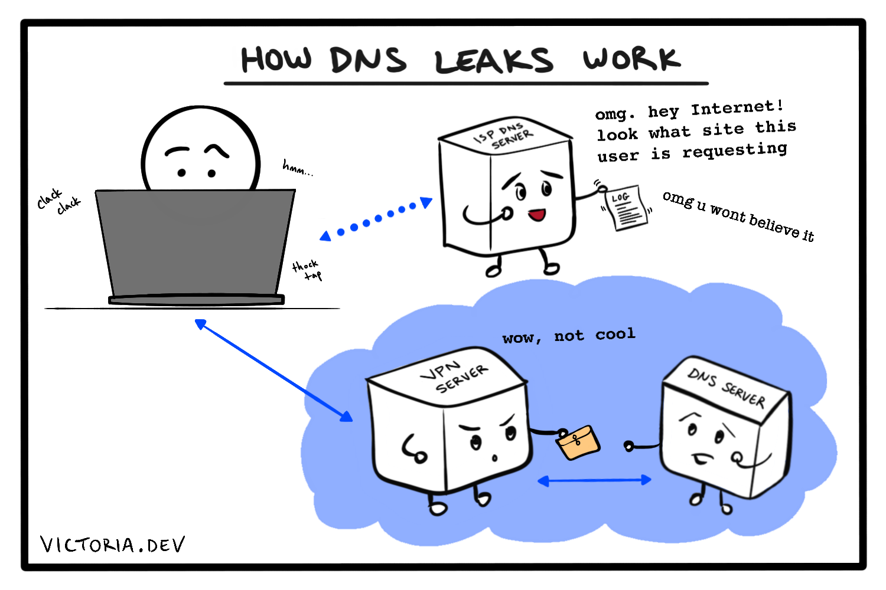

Both Internet users and Internet-connected applications can benefit from investing in cybersecurity. One core aspect of online privacy is the use of a proxy server, though this basic building block may not be initially visible underneath its more recognizable forms. Proxy servers are a useful thing to know about nowadays, for developers, software product owners, as well as the average dog on the Internet. Let's explore what makes proxy servers an important piece of cybersecurity support.

> "On the Internet, nobody knows you're a dog."

When [Peter Steiner's caption](https://en.wikipedia.org/wiki/On_the_Internet,_nobody_knows_you%27re_a_dog) was first published in The New Yorker in 1993, it reportedly went largely unnoticed. Only later did the ominous and slightly frightening allusion to online anonymity touch the public consciousness with the icy fingers of the unknown. As Internet usage became more popular, users became concerned that other people could represent themselves online in any manner they chose, without anyone else knowing who they truly were.

This, to make a gross understatement, is no longer the case. Thanks to [tracking cookies](https://support.mozilla.org/en-US/kb/enable-and-disable-cookies-website-preferences), [browser fingerprinting](https://robertheaton.com/2017/10/17/we-see-you-democratizing-de-anonymization/), [Internet Service Providers (ISPs) selling our browsing logs to advertisers](https://www.privacypolicies.com/blog/isp-tracking-you/), and our own inexplicable inclination to put our names and faces on social networks, online anonymity is out like last year's LaCroix flavours. While your next-door neighbor may not know how to find you online (well, except for through that location-based secondhand marketplace app you're using), you can be certain that at least one large advertising company has a series of zeroes and ones somewhere that represent you, the specific details of your market demographic, and all your online habits, including your preferred flavour of LaCroix.

There are ways to add _some_ layers of obscurity, like using a corporate firewall that hides your IP, or [using Tor](https://www.torproject.org/). The underlying mechanism of both these methods is the same. Like being enshrouded in the layers of an onion, we're using one or more [proxy servers](https://en.wikipedia.org/wiki/Proxy_server) to shield our slightly sulfuric selves from third-party tracking.

## What's a proxy server, anyway

A proxy, in the traditional English definition, is the "authority or power to act for another." ([Merriam-Webster](https://www.merriam-webster.com/dictionary/proxy)) A proxy server, in the computing context, is a server that acts on behalf of another server, or a user's machine.

By using a proxy to browse the Internet, for example, a user can defer being personally identifiable. All of the user's Internet traffic appears to come from the proxy server instead of their machine.

## Proxy servers are for users

There are a few ways that we, as the client, can use a proxy server to conceal our identity when we go online. It's important to know that these methods offer differing levels of anonymity, and that no single method will really provide _true_ anonymity; if others are actively seeking to find you on the Internet, for whatever reason, further steps should be taken to make your activity truly difficult to identify. (Those steps are beyond the scope of this article, but you can get started with the [Electronic Frontier Foundation's (EFF) Surveillance Self-Defense](https://ssd.eff.org/) resource.) For the average user, however, here is a small menu of options ranging from least to most anonymous.

### Use a proxy in your web browser

Certain web browsers, including Firefox and Safari on Mac, allow us to configure them to send our Internet traffic through a proxy server. The proxy server attempts to [anonymize](https://en.wikipedia.org/wiki/Anonymizer) our requests by replacing our originating IP address with the proxy server's own IP. This provides us with some anonymity, as the website we're trying to reach will not see our originating IP address; however, the proxy server that we choose to use will know exactly who originated the request. This method also doesn't necessarily encrypt traffic, block cookies, or stop social media and cross-site trackers from following us around; on the upside, it's the method least likely to prevent websites that use cookies from functioning properly.


Public proxy servers are out there, and deciding whether or not we should use any one of them is on par with deciding whether we should eat a piece of candy handed to us by a smiling stranger. If your academic institution or company provides a proxy server address, it is (hopefully) a private server with some security in place. My preferred method, if we have a little time and a few monthly dollars to invest in our security, is to set up our own virtual instance with a company such as [Amazon Web Services](https://aws.amazon.com/ec2/) or [Digital Ocean](https://www.digitalocean.com/products/droplets/) and use this as our proxy server.

To use a proxy through our browser, we can [edit our Connection Settings in Firefox](https://support.mozilla.org/en-US/kb/connection-settings-firefox), or [set up a proxy server using Safari on Mac](https://support.apple.com/guide/safari/set-up-a-proxy-server-ibrw1053/mac).

In regards to choosing a browser, I would happily recommend [Firefox](https://www.mozilla.org/en-US/firefox/new/) to any Internet user who wants to beef up the security of their browsing experience right out of the box. Mozilla has been a champion of privacy-first since I've heard of them, and recently made some well-received changes to [Enhanced Tracking Protection in Firefox Browser](https://blog.mozilla.org/blog/2019/06/04/firefox-now-available-with-enhanced-tracking-protection-by-default/) that blocks social media trackers, cross-site tracking cookies, fingerprinters, and cryptominers by default.

### Use a VPN on your device

In order to take advantage of a proxy server for all our Internet usage instead of just through one browser, we can use a Virtual Private Network (VPN). A VPN is a service, usually paid, that sends our Internet traffic through their servers, thus acting as a proxy. A VPN can be used on our laptop as well as phone and tablet devices, and since it encompasses all our Internet traffic, it doesn't require much extra effort to use other than ensuring our device is connected. Using a VPN is an effective way to keep nosy ISPs from snooping on our requests.



To use a paid, third-party VPN service, we'd usually sign up on their website and download their app. It's important to keep in mind that whichever provider we choose, we're entrusting them with our data. VPN providers anonymize our activity from the Internet, but can themselves see all our requests. Providers vary in terms of their privacy policies and the data they choose to log, so a little research may be necessary to determine which, if any, we are comfortable trusting.

We can also roll our own VPN service by using a virtual instance and [OpenVPN](https://openvpn.net/). OpenVPN is an open source VPN protocol, and can be used with a few virtual instance providers, such as [Amazon VPC](https://openvpn.net/amazon-cloud/), [Microsoft Azure](https://openvpn.net/microsoft-azure/), [Google Cloud](https://openvpn.net/google-cloud-vpn/), and [Digital Ocean Droplets](https://openvpn.net/digital-ocean-vpn/). I previously wrote a tutorial on [setting up your own personal VPN service with AWS](/blog/how-to-set-up-openvpn-on-aws-ec2-and-fix-dns-leaks-on-ubuntu-18.04-lts/) using an EC2 instance. I've been running this solution personally for about a month, and it's cost me almost $4 USD in total, which is a price I'm quite comfortable paying for some peace of mind.

### Use Tor

Tor takes the anonymity offered by a proxy server and compounds it by forwarding our requests through a [relay network](https://en.wikipedia.org/wiki/Relay_network) of other servers, each called a "node." Our traffic passes through three nodes on its way to a destination: the _guard_, _middle_, and _exit_ nodes. At each step, the request is encrypted and anonymized such that the current node only knows where to send it, and nothing more about what the request contains. This separation of knowledge means that, of the options discussed, Tor provides the most complete version of anonymity. (For a more complete explanation, see [Robert Heaton's article on how Tor works](https://robertheaton.com/2019/04/06/how-does-tor-work/), which is so excellently done that I wish I'd written it myself.)


That said, this level of anonymity comes with its own cost. Not monetary, as [Tor Browser](https://www.torproject.org/download/) is free to download and use. It is, however, slower than using a VPN or simple proxy server through a browser, due to the circuitous route our requests take.

## Proxy servers are for servers too

We're now familiar with proxy servers in the context of protecting users as they surf the web, but proxies aren't just for clients. Websites and Internet-connected applications can use [reverse proxy servers](https://en.wikipedia.org/wiki/Reverse_proxy) for obfuscation too. The "reverse" part just means that the proxy is acting on behalf of the server, instead of the client.

Why would a web server care about anonymity? Generally, they don't, at least not in the same way some users do. Web servers can benefit from using a proxy for a few different reasons; for example, they typically offer faster service to users by [caching](https://en.wikipedia.org/wiki/Web_cache) or [compressing](https://en.wikipedia.org/wiki/HTTP_compression) content to optimize delivery. From a cybersecurity perspective, however, a reverse proxy can improve an application's security posture by obfuscating the underlying infrastructure.


Basically, by placing another web server (the "proxy") in front of the web server that directly accesses all the files and assets, we make it more difficult for an attacker to pinpoint our "real" web server and mess with our stuff. Like when you want to see the store manager and the clerk you're talking to says, "I speak for the manager," and you're not really sure there even _is_ a manager, anyway, but you successfully exchange the hot pink My Little Pony they sold you for a _fuchsia_ one, thankyouverymuch, so now you're no longer concerned with who the manager is and whether or not they really exist, and if you passed them on the street you would not be able to stop them and call them out for passing off hot pink as fuchsia, and the manager is just fine with that.

Some common web servers can also act as reverse proxies, often with just a minimal and straightforward configuration change. While the best choice for your particular architecture is unknown to me, I will offer a couple common examples here.

### Using NGINX as a reverse proxy

NGINX uses the `proxy_pass` directive in its [configuration file](https://docs.nginx.com/nginx/admin-guide/basic-functionality/managing-configuration-files/) (`nginx.conf` by default) to turn itself into a reverse proxy server. The set up requires the following lines to be placed in the configuration file:

```conf
location /requested/path/ {
    proxy_pass http://www.example.com/target/path/;
}
```

This specifies that all requests for the path `/requested/path/` are forwarded to `http://www.example.com/target/path/`. The target can be a domain name or an IP address, the latter with or without a port.

The full [guide to using NGINX as a reverse proxy](https://docs.nginx.com/nginx/admin-guide/web-server/reverse-proxy/) is part of the NGINX documentation.

### Using Apache httpd as a reverse proxy

Apache httpd similarly requires some straightforward configuration to act as a reverse proxy server. In the [configuration file](https://httpd.apache.org/docs/current/configuring.html), usually `httpd.conf`, set the following directives:

```conf
ProxyPass "/requested/path/"  "http://www.example.com/target/path/"
ProxyPassReverse "/requested/path/"  "http://www.example.com/target/path/"
```

The `ProxyPass` directive ensures that all requests for the path `/requested/path/` are forwarded to `http://www.example.com/target/path/`. The `ProxyPassReverse` directive ensures that the headers sent by the web server are modified to point to the reverse proxy server instead.

The full [reverse proxy guide for Apache HTTP server](https://httpd.apache.org/docs/2.4/howto/reverse_proxy.html) is available in their documentation.

## Proxy servers _most of_ the way down

I concede that my title is a little facetious, as cybersecurity best practices aren't really some eternal infinite-regression mystery (though they may sometimes seem to be). Regardless, I hope this post has helped in your understanding of what proxy servers are, how they contribute to online anonymity for both clients and servers, and that they are an integral building block of cybersecurity practices.

If you'd like to learn more about personal best practices for online security, I highly recommend exploring the articles and resources provided by [EFF](https://www.eff.org/). For a guide to securing web sites and applications, the [OWASP Cheat Sheet Series](https://github.com/OWASP/CheatSheetSeries) is a fantastic resource.
