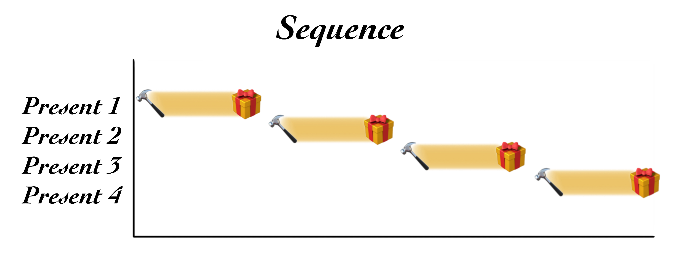
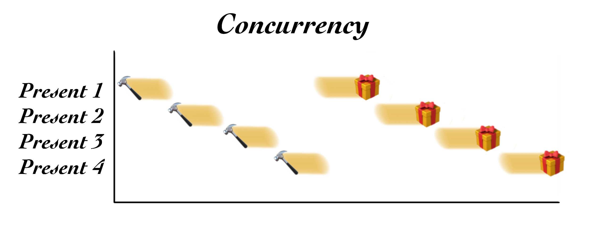

Consider the following: Santa brings toys to all the good girls and boys.

There are [7,713,468,100 people](https://en.wikipedia.org/wiki/Demographics_of_the_world#Current_population_distribution) in the world in 2019, [around 26.3%](https://en.wikipedia.org/wiki/Demographics_of_the_world#Age_structure) of which are under 15 years old. This works out to 2,028,642,110 children (persons under 15 years of age) in the world this year.

Santa doesn't seem to visit children of every religion, so we'll generalize and only include Christians and non-religious folks. Collectively that makes up [approximately 44.72%](https://en.wikipedia.org/wiki/List_of_religious_populations#Adherent_estimates_in_2019) of the population. If we assume that all kids take after their parents, then 907,208,751.6 children would appear to be Santa-eligible.

What percentage of those children are good? It's impossible to know; however, we can work on a few assumptions. One is that Santa Claus functions more on optimism than economics and would likely have prepared for the possibility that every child is a good child in any given year. Thus, he would be prepared to give a toy to every child. Let's assume it's been a great year and that all 907,208,751.6 children are getting toys.

That's a lot of presents, and, as we know, they're all made by Santa's elves at his North ~~China~~ Pole workshop. Given that there are 365 days in a year and one of them is Christmas, let's assume that Santa's elves collectively have 364 days to create and gift wrap 907,208,752 (rounded up) presents. That works out to 2,492,331.74 presents per day.

Almost two-and-a-half million presents per day is a heavy workload for any workshop. Let's look at two paradigms that Santa might employ to hit this goal: concurrency, and parallelism.

## A sequential process

Suppose that Santa's workshop is staffed by exactly one, very hard working, very tired elf. The production of one present involves four steps:

1. Cutting wood
2. Assembly and glueing
3. Painting
4. Gift-wrapping

With a single elf, only one step for one present can be happening at any instance in time. If the elf were to produce one present at a time from beginning to end, that process would be executed _sequentially_. It's not the most efficient method for producing two-and-a-half million presents per day; for instance, the elf would have to wait around doing nothing while the glue on the present was drying before moving on to the next step.

## Concurrency

In order to be more efficient, the elf works on all presents _concurrently_.

Instead of completing one present at a time, the elf first cuts all the wood for all the toys, one by one. When everything is cut, the elf assembles and glues the toys together, one after the other. This [concurrent processing](https://en.wikipedia.org/wiki/Concurrent_computing) means that the glue from the first toy has time to dry (without needing more attention from the elf) while the remaining toys are glued together. The same goes for painting, one toy at a time, and finally wrapping.

Since one elf can only do one task at a time, a single elf is using the day as efficiently as possible by concurrently producing presents.

## Parallelism

Hopefully, Santa's workshop has more than just one elf. With more elves, more toys can be built simultaneously over the course of a day. This simultaneous work means that the presents are being produced in _parallel_. [Parallel processing](https://en.wikipedia.org/wiki/Parallel_computing) carried out by multiple elves means more work happens at the same time.

Elves working in parallel can also employ concurrency. One elf can still tackle only one task at a time, so it's most efficient to have multiple elves concurrently producing presents.

Of course, if Santa's workshop has, say, two-and-a-half million elves, each elf would only need to finish a maximum of one present per day. In this case, working sequentially doesn't detract from the workshop's efficiency. There would still be 7,668.26 elves left over to fetch coffee and lunch.

## Santa Claus, and threading

After all the elves' hard work is done, it's up to Santa Claus to deliver the presents -- all 907,208,752 of them.

Santa doesn't need to make a visit to every kid; just to the one household tree. So how many trees does Santa need to visit? Again with broad generalization, we'll say that the average number of children per household worldwide is [2.45, based on the year's predicted fertility rates](https://en.wikipedia.org/wiki/Demographics_of_the_world#Total_fertility_rate). That makes 370,289,286.4 houses to visit. Let's round that up to 370,289,287.

How long does Santa have? The lore says one night, which means one earthly rotation, and thus 24 hours. [NORAD confirms](https://www.noradsanta.org/en/).

This means Santa must visit 370,289,287 households in 24 hours (86,400 seconds), at a rate of 4,285.75 households per second, nevermind the time it takes to put presents under the tree and grab a cookie.

Clearly, Santa doesn't exist in our dimension. This is especially likely given that despite being chubby and plump, he fits down a chimney (with a lit fire, while remaining unhurt) carrying a sack of toys containing presents for all the household's children. We haven't even considered the fact that his sleigh carries enough toys for every believing boy and girl around the world, and flies.

Does Santa exist outside our rules of physics? How could one entity manage to travel around the world, delivering packages, in under 24 hours at a rate of 4,285.75 households per second, and still have time for milk and cookies and kissing mommy?

One thing is certain: Santa uses the Internet. No other technology has yet enabled packages to travel quite so far and quite so quickly. Even so, attempting to reach upwards of four thousand households per second is no small task, even with even the best gigabit Internet hookup the North Pole has to offer. How might Santa increase his efficiency?

There's clearly only one logical conclusion to this mystery: Santa Claus is a multithreaded process.

## A single thread

Let's work outward. Think of a [thread](https://en.wikipedia.org/wiki/Thread_(computing)) as one particular task, or the most granular sequence of instructions that Santa might execute. One thread might execute the task, `put present under tree`. A thread is a component of a process, in this case, Santa's process of delivering presents.

If Santa Claus is [single-threaded](https://en.wikipedia.org/wiki/Thread_(computing)#Single_threading), he, as a process, would only be able to accomplish one task at a time. Since he's old and a bit forgetful, he probably has a set of instructions for delivering presents, as well as a schedule to abide by. These two things guide Santa's thread until his process is complete.

Single-threaded Santa Claus might work something like this:

1. Land sleigh at Timmy's house
2. Get Timmy's present from sleigh
3. Enter house via chimney
4. Locate Christmas tree
5. Place Timmy's present under Christmas tree
6. Exit house via chimney
7. Take off in sleigh

Rinse and repeat... another 370,289,286 times.

## Multithreading

[Multithreaded](https://en.wikipedia.org/wiki/Thread_(computing)#Multithreading) Santa Claus, by contrast, is the [Doctor Manhattan](https://dc.fandom.com/wiki/Jonathan_Osterman_(Watchmen)) of the North Pole. There's still only one Santa Claus in the world; however, he has the amazing ability to multiply his consciousness and accomplish multiple instruction sets of tasks simultaneously. These additional task workers, or worker threads, are created and controlled by the main process of Santa delivering presents.

Each worker thread acts independently to complete its instructions. Since they all belong to Santa's consciousness, they share Santa's memory and know everything that Santa knows, including what planet they're running around on, and where to get the presents from.

With this shared knowledge, each thread is able to execute its set of instructions in parallel with the other threads. This multithreaded parallelism makes the one and only Santa Claus as efficient as possible.

If an average present delivery run takes an hour, Santa need only spawn 4,286 worker threads. With each making one delivery trip per hour, Santa will have completed all 370,289,287 trips by the end of the night.

Of course, in theory, Santa could even spawn 370,289,287 worker threads, each flying to one household to deliver presents for all the children in it! That would make Santa's process extremely efficient, and also explain how he manages to consume all those milk-dunked cookies without getting full. 🥛🍪🍪🍪

## An efficient and merry multithreaded Christmas

Thanks to modern computing, we now finally understand how Santa Claus manages the seemingly-impossible task of delivering toys to good girls and boys the world-over. From my family to yours, I hope you have a wonderful Christmas. Don't forget to hang up your stockings on the router shelf.

Of course, none of this explains how reindeer manage to fly.
