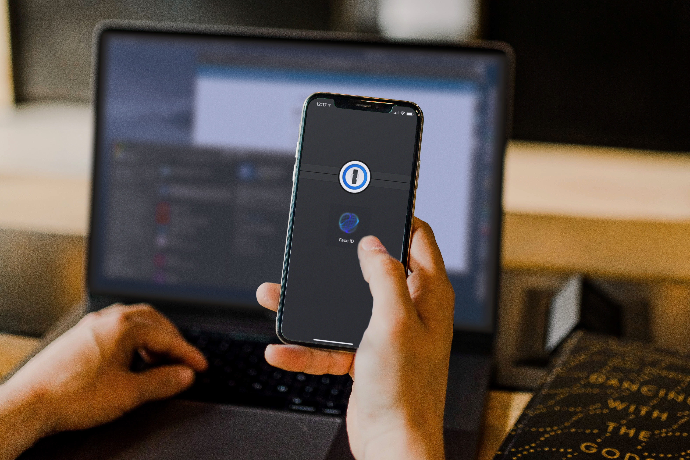
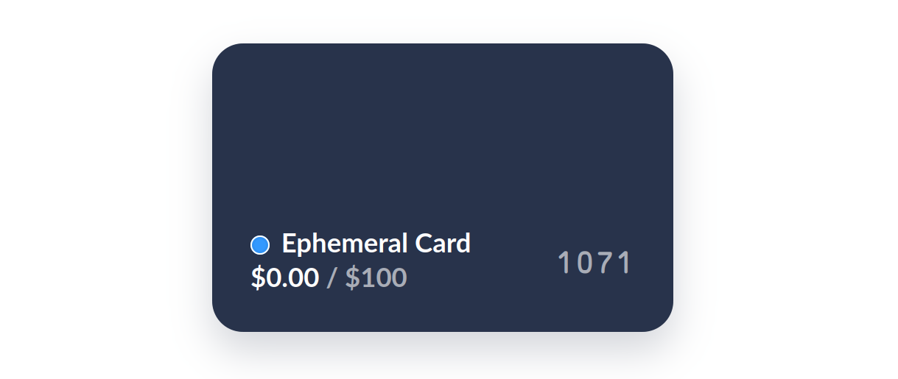

We've already got enough to deal with without worrying about our cybersecurity. When humans are busy and under stress, we tend to get lax in less-obviously-pressing areas, like the integrity of our online accounts. These areas only become an obvious problem when it's too late for prevention.

Cybersecurity can be fiddly and time-consuming. You might need to reset forgotten passwords, transfer multifactor authentication (MFA) codes to different devices, or deal with the fallout of compromised payment details in the event one of your accounts is still breached.

Thankfully, most of the work necessary to keep up our cybersecurity measures can be outsourced.

Here are three changes you can make to significantly reduce the chances of needing to fiddle with any of these things again.

## 1Password

I've historically avoided password managers because of an irrational knee-jerk reaction to putting all my eggs in one basket. You know what's great for irrational reactions? Education.

To figure out if putting all my passwords into a password manager is more secure than not using one, I set out to see what some smart people wrote about it.

First, we need to know a thing or two about passwords. Troy Hunt figured out almost a decade ago that [trying to remember strong passwords doesn't work](https://www.troyhunt.com/only-secure-password-is-one-you-cant/). In more recent times, Alex Weinert expanded on this in [Your Pa$$word doesn't matter](https://techcommunity.microsoft.com/t5/azure-active-directory-identity/your-pa-word-doesn-t-matter/ba-p/731984). TL;DR: our brains aren't better at passwords than computers, and please use MFA.

So passwords don't matter, but complicated passwords are still better than memorable and guessable ones. Since I've next to no hope of remembering a dozen variations of `p/q2-q4!` (I'm not a [chess player](https://inbox.vuxu.org/tuhs/CAG=a+rj8VcXjS-ftaj8P2_duLFSUpmNgB4-dYwnTsY_8g5WdEA@mail.gmail.com/)), this is a task I can outsource to [1Password](https://1password.com/). I'll still need to remember one, long, complicated master password - 1Password uses this to encrypt my data, so I really can't lose it - but I can handle just one.

Using 1Password specifically has another, decidedly obvious, advantage. I chose 1Password because of their [Watchtower](https://support.1password.com/watchtower/) feature. [Thanks to Troy Hunt's Have I Been Pwned](https://www.troyhunt.com/have-i-been-pwned-is-now-partnering-with-1password/), Watchtower will alert you if any of your passwords show up in a breach so you can change them. Passwords still don't completely work, but this is probably the best band-aid there is.

One last bonus is that using a password manager is a heck of a lot more convenient. I don't need to take a few tries to type in a complicated password. I don't end up spending time resetting passwords I've forgotten on sites I only rarely use.

When tasked with remembering all their own passwords, people typically create simpler passwords that are easier to remember -- and easier to hack. This occurs most frequently on sites that are considered unimportant. Using 1Password and generated passwords, those sites are now also first-class citizens in the land of strong passwords, instead of being half-abandoned and half-open attack vectors.

So, yes, all my eggs are in one basket. A well-protected, complex, and monitored basket.

## Authy

Okay - so it's more like one-and-a-half baskets. 🤷🏻

[Authy](https://authy.com/), from the folks over at [Twilio](https://www.twilio.com), provides a 2FA solution that's more secure than SMS. [Unlike Google Authenticator](https://authy.com/blog/authy-vs-google-authenticator/), you can choose to back up your 2FA codes in case you lose or change your phone. (1Password offers 2FA functionality as well - but, you know, redundancies.)

With Authy, your back up is encrypted with your password, similarly to how 1Password works. This makes it the second password you can't forget, if you don't want to lose access to your codes. If you reset your account, they all go away. I can deal with remembering two passwords; I'll take that trade.

I've tried other methods of MFA, including hardware keys, which can make accessing accounts on your phone more complicated than I care to put up with. I find the combination of 1Password and Authy to be the most practical combination of convenience and security that yet exists to my knowledge.

## Privacy.com

Finally, there's one last line of defense you can put in place in the unfortunate event that one of your accounts is still compromised. All the strong passwords and MFA in the world won't help if you open the doors yourself, and scams and phishing are a thing.

Since it's rather impractical to use a different real credit card every place you shop, virtual cards are just a great idea. There's no good reason to spend an afternoon (or more) resetting your payment information on every account just to thwart a misbehaving merchant or patch up a data breach from that online shop for cute salt shakers you made a purchase at last year (just me?).

As a bonus, a [partnership between 1Password and Privacy.com](https://blog.privacy.com/create-virtual-cards-with-privacy-and-1password/) lets you easily create virtual credit cards using the 1Password extension.

By setting up a separate virtual card for each merchant, in the event that one of those merchants is compromised, you can simply pause or delete that card. None of your other accounts or actual bank details are caught up in the process. Cards can have time-based limits or be one-off burner numbers, making them ideal for setting up subscriptions.

This is the sort of basic functionality that I hope, one day, becomes more prevalent from banks and credit cards. In the meantime, I'll keep using [Privacy.com](https://privacy.com/join/Q6V3V). That's my referral link; if you'd like to thank me by using it, we'll both get five bucks as a bonus.

## Outsource better security

All together, implementing these changes will probably take up an afternoon, depending on how many accounts you have. It's worth it for the time you'd otherwise spend resetting passwords, setting up new devices, or (knock on wood) recovering from compromised banking details. Best of all, you'll have continual protection just running in the background.

- [1Password](https://1password.com/)
- [Authy](https://authy.com/)
- [Privacy.com](https://privacy.com/join/Q6V3V)

We have the technology. Free up some brain cycles to focus on other things - or simply remove some unnecessary stress from your life by outsourcing the fiddly bits.

Want to give the gift of cybersecurity to someone you know? Get them started with a [cybersecurity starter pack](/blog/your-cybersecurity-starter-pack/).
