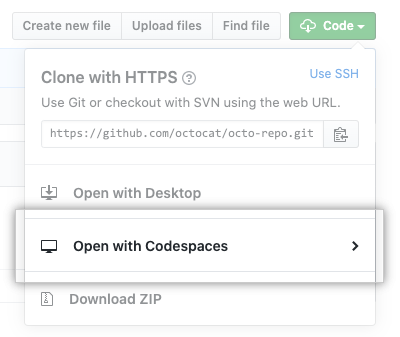

The most recent integration between Visual Studio Code and GitHub can help make development accessible and welcoming: Codespaces in GitHub!

Now in beta, [GitHub Codespaces](https://docs.github.com/en/github/developing-online-with-codespaces/about-codespaces) provide an online, in-the-browser IDE powered by Visual Studio Code. This lets you use this full-featured IDE, complete with extensions, terminal, Git commands, and all the settings you're accustomed to, on any machine. You can now bring your development workflow anywhere using a tablet or other browser-based device.

Codespaces is great news for open source contributors, too. [Adding a codespace configuration](https://docs.github.com/en/github/developing-online-with-codespaces/configuring-codespaces-for-your-project) to your project is a great way to invite new folks to easily start contributing.

A new open source contributor or new hire at your organization can quickly fire up a codespace and get hacking on a `good first issue` with no local environment set up or installations necessary!

We've added codespace configuration settings over at the [OWASP Web Security Testing Guide (WSTG)](https://github.com/OWASP/wstg). Want to take it for a spin? See our [open issues](https://github.com/OWASP/wstg/issues).

## Configuring Codespaces

You can use Visual Studio Code's `.devcontainer` folder to configure a development container for your repository as well.

Many [pre-built containers are available](https://github.com/microsoft/vscode-dev-containers/tree/master/containers) -- just copy the `.devcontainer` you need to your repository root. If your repository doesn't have one, a [default base Linux image](https://github.com/microsoft/vscode-dev-containers/tree/master/containers/codespaces-linux) will be used.

Here's a reason to remove `.vscode` from your `.gitignore` file. Any new codespaces created in your repository will now respect settings found at `.vscode/settings.json`. This means that your online IDE can have the same Workspace configuration as you have on your local machine. Isn't that useful!

## Making Codespaces personal

For next-level [dotfiles personalization](https://docs.github.com/en/github/developing-online-with-codespaces/personalizing-codespaces-for-your-account), consider committing relevant files from your local `dotfiles` folder as a public GitHub repository at `yourusername/dotfiles`.

When you create a new codespace, this brings in your configurations, such as shell aliases and preferences, by creating symlinks to dotfiles in your codespace `$HOME`. This personalizes all the codespaces you create in your account.

Need some inspiration? Browse [my dotfiles repository on GitHub](https://github.com/victoriadrake/dotfiles).

[Developing in a codespace](https://docs.github.com/en/github/developing-online-with-codespaces/developing-in-a-codespace) is a familiar experience for Visual Studio Code users, right down to running an application locally.

Thanks to [port forwarding](https://docs.github.com/en/github/developing-online-with-codespaces/developing-in-a-codespace), when I run an application in a codespace terminal, clicking on the resulting `localhost` URL takes me to the appropriate port as output from my codespace.

When I'm working on this website in my codespace, for example, I run `hugo serve` then click the provided `localhost:1313` link to see a preview of my changes in another browser tab.

Want to stay in sync between devices? There's an extension for that. You can [connect to your codespace from Visual Studio Code](https://docs.github.com/en/github/developing-online-with-codespaces/connecting-to-your-codespace-from-visual-studio-code) on your local machine so you can always pick up right where you left off.

## Develop anywhere

Codespaces is a super exciting addition to my GitHub workflow. It allows me to access my full development process pretty much anywhere, using devices like my iPad.

It'll also make it easier for new open source contributors or new hires at your organization to hit the ground running with a set-up IDE. If you have access to the limited beta, I invite you to spin up a codespace and try [contributing to the WSTG](https://github.com/OWASP/wstg/issues), or to [an issue on one of my open source projects](https://github.com/victoriadrake?tab=repositories).

I'm looking forward to general availability and seeing what the open source community will dream up for GitHub Codespaces next!

And yes -- codespaces support [your favorite Visual Studio Code theme](https://github.com/victoriadrake/kabukicho-vscode). 😈


