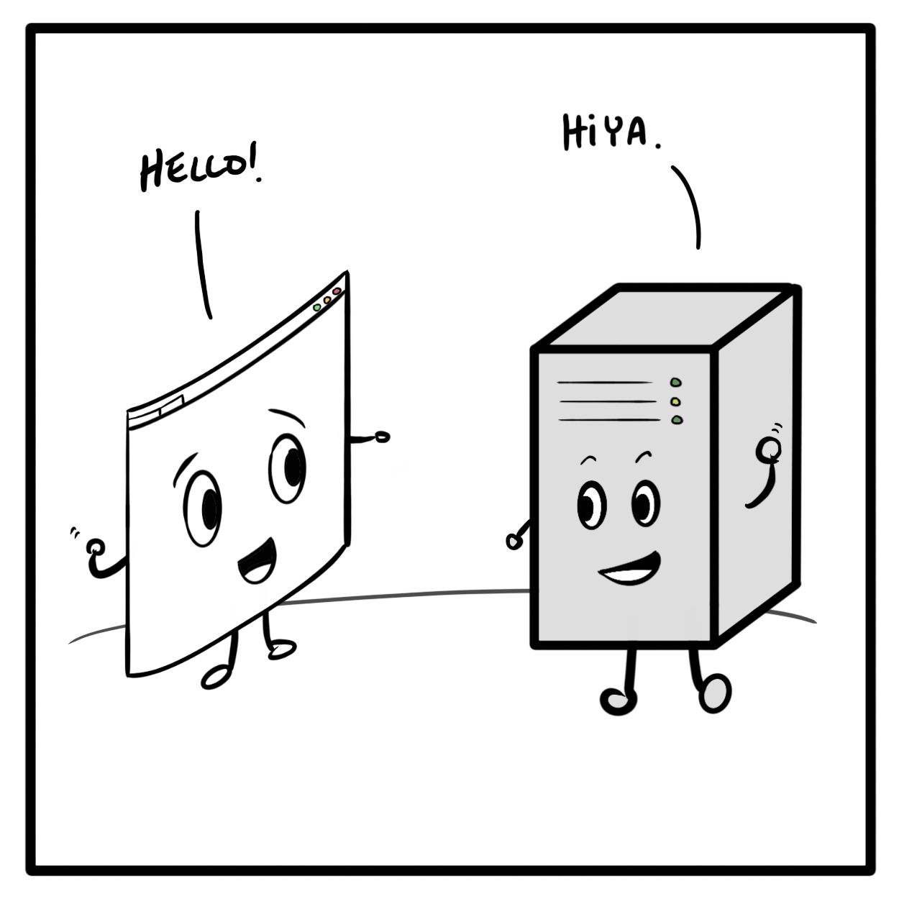

If you want to have a confidential conversation with someone you know, you might meet up in person and find a private place to talk. If you want to send data confidentially over the Internet, you might have a few more considerations to cover.

TLS, or Transport Layer Security, refers to a protocol. "Protocol" is a word that means, "the way we've agreed to do things around here," more or less. The "transport layer" part of TLS simply refers to host-to-host communication, such as how a client and a server interact, in the [Internet protocol suite model](https://en.wikipedia.org/wiki/Internet_protocol_suite).

The TLS protocol attempts to solve these fundamental problems:

- How do I know you are who you say you are?
- How do I know this message from you hasn't been tampered with?
- How can we communicate securely?

Here's how TLS works, explained in plain English. As with many successful interactions, it begins with a handshake.

## Getting to know you

The basic process of a [TLS handshake](https://en.wikipedia.org/wiki/Transport_Layer_Security#TLS_handshake) involves a client, such as your web browser, and a server, such as one hosting a website, establishing some ground rules for communication. It begins with the client saying hello. Literally. It's called a *ClientHello* message.

The *ClientHello* message tells the server which TLS protocol version and _cipher suites_ it supports. While "cipher suite" sounds like a fancy hotel upgrade, it just refers to a set of algorithms that can be used to secure communications. The server, in a similarly named *ServerHello* message, chooses the protocol version and cipher suite to use from the choices offered. Other data may also be sent, for example, a _session ID_ if the server supports resuming a previous handshake.

Depending on the cipher suite chosen, the client and server exchange further information in order to establish a shared secret. Often, this process moves the exchange from [asymmetric cryptography](https://en.wikipedia.org/wiki/Public-key_cryptography) to [symmetric cryptography](https://en.wikipedia.org/wiki/Symmetric-key_algorithm) with varying levels of complexity. Let's explore these concepts at a general level and see why they matter to TLS.

## Asymmetric beginnings

This is asymmetry:



Asymmetric cryptography is one method by which you can perform _authentication_. When you authenticate yourself, you answer the fundamental question, "How do I know you are who you say you are?"

In an asymmetric cryptographic system, you use a pair of keys in order to achieve authentication. These keys are asymmetric. One key is your public key, which, as you would guess, is public. The other is your private key, which -- well, you know.

Typically, during the TLS handshake, the server will provide its public key via its digital certificate, sometimes still called its _SSL certificate_, though TLS replaces the deprecated Secure Sockets Layer (SSL) protocol. Digital certificates are provided and verified by trusted third parties known as [Certificate Authorities (CA)](https://en.wikipedia.org/wiki/Certificate_authority), which are a whole other article in themselves.

While anyone may encrypt a message using your public key, only your private key can then decrypt that message. The security of asymmetric cryptography relies only on your private key staying private, hence the asymmetry. It's also asymmetric in the sense that it's a one-way trip. Alice can send messages encrypted with your public key to you, but neither of your keys will help you send an encrypted message to Alice.

## Symmetric secrets

Asymmetric cryptography also requires more computational resources than symmetric cryptography. Thus when a TLS handshake begins with an asymmetric exchange, the client and server will use this initial communication to establish a shared secret, sometimes called a _session key_. This key is symmetric, meaning that both parties use the same shared secret and must maintain that secrecy for the encryption to be secure.



By using the initial asymmetric communication to establish a session key, the client and server can rely on the session key being known only to them. For the rest of the session, they'll both use this same shared key to encrypt and decrypt messages, which speeds up communication.

## Secure sessions

A TLS handshake may use asymmetric cryptography or other cipher suites to establish the shared session key. Once the session key is established, the handshaking portion is complete and the session begins.

The _session_ is the duration of encrypted communication between the client and server. During this time, messages are encrypted and decrypted using the session key that only the client and server have. This ensures that communication is secure.

The integrity of exchanged information is maintained by using a checksum. Messages exchanged using session keys have a [message authentication code (MAC)](https://en.wikipedia.org/wiki/Message_authentication_code) attached. This is not the same thing as your device's [MAC address](https://en.wikipedia.org/wiki/MAC_address). The MAC is generated and verified using the session key. Because of this, either party can detect if a message has been changed before being received. This solves the fundamental question, "How do I know this message from you hasn't been tampered with?"

Sessions can end deliberately, due to network disconnection, or from the client staying idle for too long. Once a session ends, it must be re-established via a new handshake or through previously established secrets called _session IDs_ that allow resuming a session.

## TLS and you

Let's recap:

- TLS is a cryptographic protocol for providing secure communication.
- The process of creating a secure connection begins with a handshake.
- The handshake establishes a shared session key that is then used to secure messages and provide message integrity.
- Sessions are temporary, and once ended, must be re-established or resumed.

This is just a surface-level skim of the very complex cryptographic systems that help to keep your communications secure. For more depth on the topic, I recommend exploring cipher suites and the various [supported algorithms](https://en.wikipedia.org/wiki/Cipher_suite#Supported_algorithms).

The TLS protocol serves a very important purpose in your everyday life. It helps to secure your emails to family, your online banking activities, and the connection by which you're reading this article. The [HTTPS communication protocol](https://en.wikipedia.org/wiki/HTTPS) is encrypted using TLS. Every time you see that little lock icon in your URL bar, you're experiencing firsthand all the concepts you've just read about in this article. Now you know the answer to the last question: "How can we communicate securely?"
