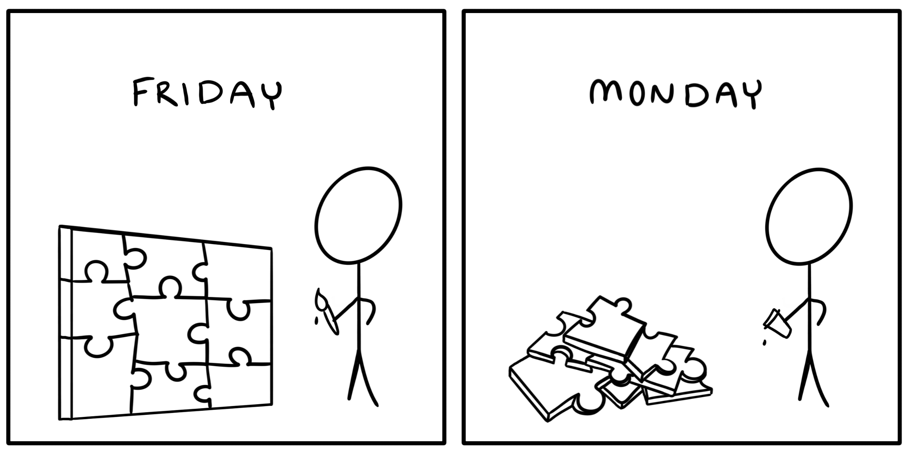

If you've ever half-written a software project before taking a few days off, this is the article you'll discover you needed when you reopen that IDE.

In the technology teams I lead, we make a constant effort to document all the things. Documentation lives alongside the code as an equal player. This helps ensure that no one needs to make assumptions about how something works, or is calling lengthy meetings to gain working knowledge of a feature. Good documentation saves us a lot of time and hassle.

That said, and contrary to popular belief, the most valuable software documentation is not primarily written for other people. As I said in this well-received tweet:

<blockquote class="twitter-tweet">
The secret to good documentation is to write it while you&#39;re writing the code. You are your first audience. Explain what you&#39;re doing to yourself. Future you will thank you!
&mdash; Victoria Drake <a href="https://twitter.com/victoriadotdev/status/1331262801797652483?ref_src=twsrc%5Etfw">November 24, 2020</a></blockquote> 

Here are three concrete steps you can take to write good documentation before it's too late.

## 1. Start with accurate notes

As you work out ideas in code, ensure you don’t soon forget important details by starting with accurate notes. While you will want to explain things to yourself in long-form later, short-form notes will suffice to capture details without interrupting your coding session flow.

Don't rely on inline comments that often fail to make sense once you've forgotten the context. Keep a document open alongside your code and write down things like commands, decisions, and sources you use. This can include:

- Prompts or shell commands you used
- Why you chose a particular method over another
- Links you visited for help or *cough*copy-paste*cough* inspiration
- The order in which you did things

Don’t worry about full sentences at this point. Just ensure you accurately capture context, relevant code snippets, and helpful URLs. It can also be helpful to turn on any auto-save option available.

## 2. Explain decisions in long form

The ideal time to tackle this step is when you take a break from coding, but before you completely go out to lunch on whatever it is you’re working on at the moment. You want to ensure that context, ideas, and decisions are all still fresh in your mind when you explain them to yourself.

Go over the short-form notes you took and start expanding them into conversational writing. Be your own rubber duck. Describe what you’re doing as if you were teaching it to someone else. You might cover topics such as:

- Quirky-looking decisions: "I would normally do it this way, but I chose to do something different because..."
- Challenges you ran into and how you overcame them
- Architectural decisions that support your project goals

Stick to the main points. Long-form writing doesn’t mean you’ll be paid by the word! Just use full sentences, and write as if explaining your project to a colleague. You’re explaining to future you, after all.

## 3. Don't neglect prerequisite knowledge

This step is best done after a long lunch break, or even the next day (but probably not two). Re-read your document and fill in any blanks that become apparent after putting some distance between yourself and the project.

Take extra care to fill in or at least link to prerequisite knowledge, especially if you frequently use different languages or tools. Even an action as small as pasting in a link to the API documentation you used can save hours of future searching.

Write down or link to READMEs, installation steps, and relevant support issues. For frequently performed command-line actions, you can use a [self-documenting Makefile](/posts/how-to-create-a-self-documenting-makefile/) to avoid having to `man` common tasks each time you come back to a project.

It’s easy to forget supporting details after even just a short break from your project. Capture anything you found helpful this time around.

## Document all the things

The next time you catch yourself thinking, “I’m sure I’ll remember this part, no need to write it down,” just recall this emoji: 🤦‍♀️

Software projects are made up of a lot more than just their code. To best set up your future self for success, document all the things! Whether it’s a process you’ve established, Infrastructure as Code, or a fleeting future roadmap idea — write it down! Future you will thank you for it.

If you enjoyed this post, there's a lot more where that came from! I write about developer ergonomics for high-performing teams and building beautiful, maintainable software in the age of AI. You can subscribe below to see new posts first.


