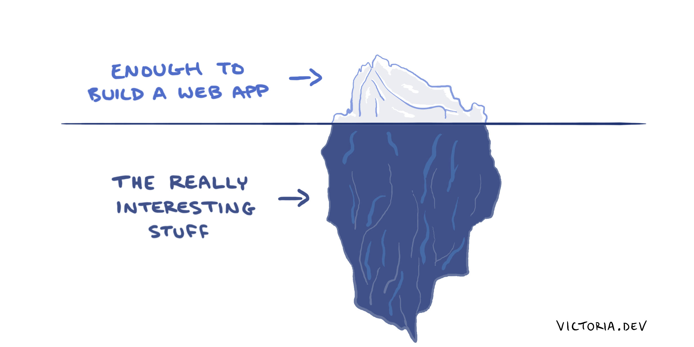
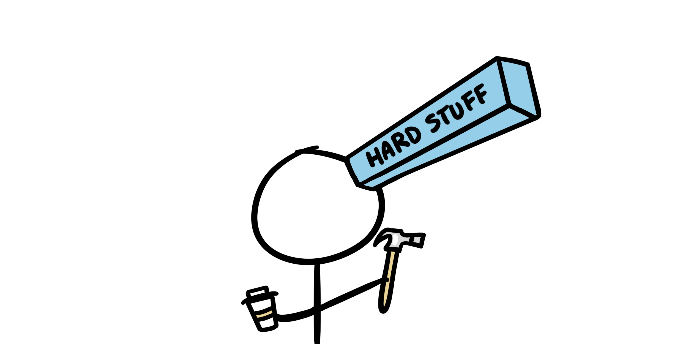
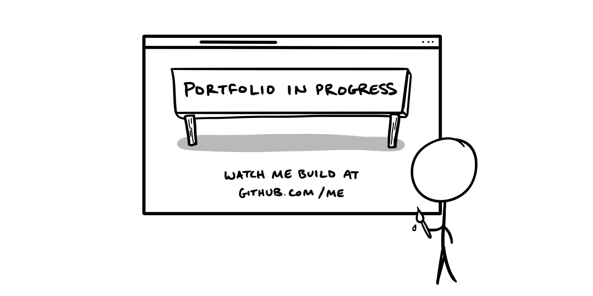

As a Director of Engineering, I’m a software developer who hires and leads other software developers. It’s not surprising then that I get asked this question a lot, in various forms:

- *How do I become a software developer?*
- *What language or framework should I learn first?*
- *Where do I start?*

While I’m certain there’s no one right answer for everyone, I’m also certain that the world needs more software developers and systems thinkers.

The best thing I can do to help you lead yourself, learn to code, and become a software developer is to share the most efficient parts of how I did it myself. This is the article I wish I had read when I started coding.

## Depth matters

Software is exceedingly complex. Like a good novel that you wish you’d never finish reading, there’s always more to discover and learn. If you don’t want to miss the best parts, don’t be satisfied with surface-level explanations. Always go deeper! Ask why, why, and why again until you get to the fundamentals. Soon enough, you’ll start to see patterns.

By digging deeper, you’ll begin to understand the fundamentals of how things connect, what makes things “fast,” and facets of software operation that you probably can’t even imagine exist. It’s like peeking behind the curtain and seeing a whole world of systems and processes that most people are never aware of.

Going in-depth can expand your mind and your capacity for learning. Keep asking why. Follow every link. Let your curiosity guide you.

## Hard stuff matters

Giving yourself the chance to be delighted through discovery doesn’t come for free. It takes a lot of hard work to read and compress complicated ideas into your meat brain.

It’s important not to gloss over the hard stuff. In fact, if something seems too hard to understand, you might benefit from doing it first. You might have to get creative to find ways to explain things to yourself, but when you succeed, it makes everything else easier later on.

Analogies are helpful for understanding hard concepts, but they’ll only help you start to understand concepts at a surface level. Remember to go in-depth. Don't stop at the analogy.

## Writing matters

Write right away. Create a habit of explaining everything you learn to yourself in long-form writing. Better than bullet points, writing with a conversational tone engages parts of your brain that help you to process and remember new information. It’s why humans like and remember stories, and it’s a superpower you get for free.

Start by writing for yourself. Write about what interests you. Try something new, even if it seems rudimentary, and write in-depth about what you learn. ([One of my most popular posts](/blog/iteration-in-python-for-list-and-map/) is about iteration in Python. When I first wrote it, I considered myself a complete beginner.)

If you want to go a step further, share your writing with the world. Learn in public, [like I do](https://victoria.dev). I often get questions like, "how do I choose a theme for my blog?" or "what platform should I use?" or "what popular language/framework/topic should I focus on?" My answer is: don't worry about it.

Don't fret too much about your blog theme or platform. Pick the easiest option for you to get started with for now. All of that will change and improve as you learn, practice, and find your focus. Just start writing, ideally, yesterday.

Write for yourself by explaining what you’re doing, as if it were past-you teaching future-you — because it is. You will be your first reader, and the first judge of how useful your blog can be. Seek to impress yourself!

## The language, framework, or version doesn’t matter

Why pigeonhole your abilities before you even start? Pick any software language, framework, or technology that seems to make sense to you when you first read it. Start there.

Remember that it’s important to dig deep and understand the fundamentals. Basic concepts of software transcend languages. Whichever first language you choose, understand functions, variables, return values, iteration, and how immutability works. You’ll find that learning these concepts will make it easier to recognize them in your second language, and learn that too.

## Your portfolio doesn’t matter

If your first objective is to build a portfolio, you may be trying to run before you walk. Building a portfolio to showcase to potential employers is a great goal, but a terrible first step.

If you think of creating a polished portfolio as a first step, you’re liable to spend too much time making it pretty and presentable before focusing on the content. As someone who hires software developers, I can tell you wholeheartedly that I’d rather see clean and well-written code than a flashy front page.

Don’t confuse building a portfolio with building projects. Absolutely build projects, right from the beginning. There’s no better way to see the practical application of what you’re learning. Just treat them as first drafts, as training ground, and don’t worry about packaging them up for professional consumption.

By allowing yourself to build some draft projects first, you allow yourself the breathing room to learn from them. Focus on iteration, on making one small thing better each time, and you'll build a portfolio without even realizing it.

## Focus on what matters

Don’t follow this advice blindly; rather, incorporate it into your own systems. Experiment, make it work better than when you found it, then pay it forward by writing down what you've learned for someone else to read!

Here are my favorite books for reading or listening to if you want to cultivate a learning mindset. See [non-coding books for coders](/bookshelf/).

If this article benefits you in some way, I encourage you to write about it! The process of learning how to learn is never finished. You can be the next iteration.
