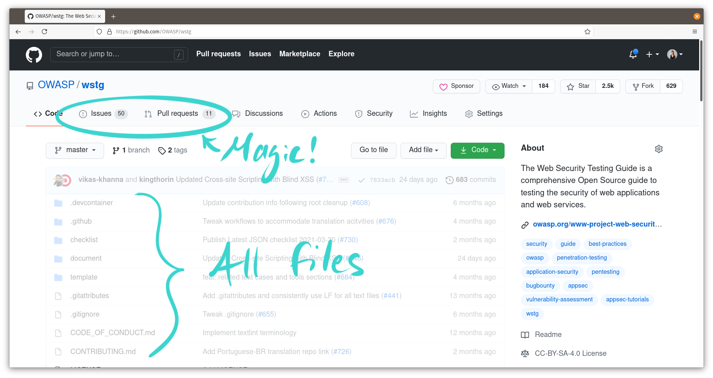

As I write this, the front page of GitHub.com declares in big bold letters that this is "Where the world builds software." This is true. In technology companies today, the creation of your product is largely happening where your developers spend time. It's where big and small product decisions are made every day -- the kind of decisions that, wittingly or not, will decide the future of your company.

I'm writing this guide for a very specific person -- possibly you, or someone you know. I'll explain how a non-technical business leader can find information and take part in the decisions and questions that happen only on GitHub. You don't need to know how to use Git. You just need a few minutes to follow along, and a desire to be a resource and servant leader for your teams. Let's do it!

If you haven't signed up yet, click below to read the very first steps. Once you're logged in, read on to join in!

<details>
<summary>The very first steps</summary>

GitHub comes in two different flavors: GitHub Enterprise, or GitHub.com. If your team uses GitHub.com, you can [sign up here](https://github.com/join) using your work email.

With GitHub Enterprise, signing up depends on your individual company's configuration. For example, you may be set up to log in with SAML single sign-on (such as through your GSuite credentials). Get in touch with the folks administering Enterprise in order to get signed up or logged in.

For the rest of this guide, it doesn't matter if you're using GitHub Enterprise or GitHub.com -- they're largely the same. Just ensure you get connected to your company's Organization or Team, if there is one. Someone with administrative privileges needs to invite you using the email you signed up with.
</details>

## Where the magic happens

On GitHub, work is typically grouped by projects or products into what's called **repositories**. Your team or company may have just one of these that they regularly use (they might call it a "monorepo") or several repositories that represent different technical components of a single product.

Once you log in, you'll be on the **Recent activity** page. You can search for the name of the repository you want to visit in the search bar at the top left. If your company's repositories are private, you may need to be invited by an administrator in order to view it.


When you view a repository, it looks like this. I've pointed out some of the important bits.



In any repository, there are two main areas where decisions usually take place. These are in **Issues** and **Pull Requests**, and you'll mainly focus your attention here. Click on the **Issues** tab to see these.

You'll be presented with a list of Issues, which you can think of as individual topics. This format is essentially a discussion board. Clicking on any of the Issue titles will take you to its thread.


Here's where the magic happens! Folks on your team use Issues to discuss all kinds of topics. These may be a very technical and esoteric cost-benefit analysis, or a fundamental customer-facing design decision. A quick read of the first message in the thread is likely to reveal whether it's a decision that could use your help.

Issues are a starting point for work. Here, team members make decisions about the type and scope of a change they plan to make.

When someone has their changes ready, they'll open a Pull Request so that other team members can preview and give input on those changes before they become part of the repository. Click the **Pull Request** tab at the top to view these.

You're presented with a very similar view on this page -- yes, it's another discussion board! You can click on any Pull Request to view its thread as well.

Pull Requests have some additional tabs that team members use for code reviews. All the conversation will show up in the **Conversation** tab.


## Sorting out what's relevant

A lot of discussion happens in Issues and Pull Request threads, and not all of it may be relevant for you to look at. Thankfully, GitHub has some excellent collaboration tools that can help your team direct your attention to where it's most needed. These are [@mentions](https://github.blog/2011-03-23-mention-somebody-they-re-notified/) and labels.

### Ask to be @mentioned

These work the same way on GitHub as they do on Twitter. When someone @mentions you, you'll receive a notification via email, or you'll see it in your [Notification Center](https://github.com/notifications) when you're logged in. This depends on your notification settings, which you should adjust to your liking. If you only want to be notified when someone @mentions you or replies to you, you should uncheck everything on the [Notification Settings page](https://github.com/settings/notifications) except for your preferred options under **Participating**.


Now when someone references you in a discussion on GitHub, you'll be notified and you'll have the chance to respond!

### Using labels

Another less direct way to see where you can effectively contribute is to ask your team to use labels. You may recall seeing these in the right sidebar of Issue and Pull Request threads:


You can create different labels to categorize a discussion, and you can apply as many labels to a discussion as you like. In order to have your team draw your attention to threads that might benefit from your input or guidance, ask folks to use a label to point these out. This could be the `question` label, or any new label of your choosing.

Clicking on a label in the sidebar will take you to a page that shows all the Issues or Pull Requests with that label. The URL will look something like:

```text
https://github.com/<organization name>/<repository name>/labels/question
```

You can also bookmark this page to easily check it on a regular schedule. This is a great, low-friction way for your team to indicate areas that could use your input.

## Collaborating on files

Similar to tracking changes in Google Docs or Word documents, you can edit documents in GitHub in a way that lets your team see the changes you've made. This is a fantastic method for collaborating with your team where they work, and avoids the hassle of emailing attachments around.

Text files in repositories have extensions such as `.md` for Markdown, or `.txt` for plain text. The majority of documentation on GitHub is in Markdown format. Clicking on any file in the repository file list will open it on the GitHub website. At the top right of the document, look for these buttons:


Clicking on the pencil icon will let you edit the file right there in your web browser. You may not see anything special as you're typing, but once you commit (like saving) your file, all your changes are tracked with Git! For a step-by-step guide to editing, see [Editing files in your repository](https://docs.github.com/en/github/managing-files-in-a-repository/managing-files-on-github/editing-files-in-your-repository).

Here are some helpful [articles for formatting text with Markdown on GitHub](https://docs.github.com/en/github/writing-on-github).

## Proactive participation

GitHub is well-structured as a collaboration platform. That's why people of all professions use it not just for software development, but also for networking, getting jobs and sponsorships, and even for hosting simple no-code websites. My own company uses GitHub for everything from collaborating on company documentation to automated Change Control Board processes for FedRAMP.

At your leisure, I encourage you to chase your curiosity and explore. Don't be shy about asking questions, or asking technical folks on your team to explain something if you think it will enable you to be a bigger help to them. With so much of the world building software on GitHub, there's a lot you can contribute when you're where the work happens.
