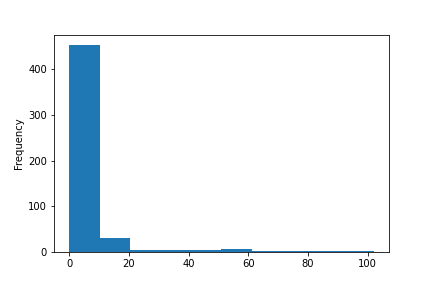

How long does it take for a bug to get squashed, or for a pull request to be merged? What kind of issues take the longest to close?

Most organizations want to improve productivity and output, but few technical teams seem to take a data-driven approach to discovering productivity bottlenecks. If you're looking to improve development velocity, a couple key metrics could help your team get unblocked. Here's how you can apply a smidge of data science to visualize how your repository is doing, and where improvements can be made.

## Getting quality data

The first and most difficult part, as any data scientist would likely tell you, is ensuring the quality of your data. It's especially important to consider consistency: are dates throughout the dataset presented in a consistent format? Have tags or labels been applied under consistent rules? Does the dataset contain repeated values, empty values, or unmatched types?

If your repository has previously changed up processes or standards, consider the timeframe of the data you collect. If labeling issues is done arbitrarily, those may not be a useful feature. While cleaning data is outside the scope of this article, I can, at least, help you painlessly collect it.

I wrote a straightforward [Python utility](https://github.com/victoriadrake/got-issues/) that uses the GitHub API to pull data for any repository. You can use this on the command line and output the data to a file. It uses the [list repository issues endpoint (docs)](https://docs.github.com/en/rest/reference/issues#list-repository-issues), which, perhaps confusingly, includes both issues and pull requests (PRs) for the repository. I get my data like this:

```sh
$ python fetch.py -h
usage: fetch.py [-h] [--token TOKEN] repository months
$ python fetch.py OWASP/wstg 24 > data.json
```

Using the GitHub API means less worry about standardization, for example, all the dates are expressed as ISO 8601. Now that you have some data to process, it's time to play with Pandas.

## Plotting with Pandas

You can use a [Jupyter Notebook](https://jupyter.org/) to do some simple calculations and data visualization.

First, create the Notebook file:

```sh
touch stats.ipynb
```

Open the file in your favorite IDE, or in your browser by running `jupyter notebook`.

In the first code cell, import Pandas and load your data:

```py
import pandas as pd

data = pd.read_json("data.json")
data
```

You can then run that cell to see a preview of the data you collected.

Pandas is a [well-documented](https://pandas.pydata.org/pandas-docs/stable/index.html) data analysis library. With a little imagination and a few keyword searches, you can begin to measure all kinds of repository metrics. For this walk-through, here's how you can calculate and create a graph that shows the number of days an issue or PR remains open in your repository.

Create a new code cell and, for each item in your [Series](https://pandas.pydata.org/pandas-docs/stable/reference/api/pandas.Series.html), subtract the date it was closed from the date it was created:

```py
duration = pd.Series(data.closed_at - data.created_at)
duration.describe()
```

[`Series.describe()`](https://pandas.pydata.org/pandas-docs/stable/reference/api/pandas.Series.describe.html) will give you some summary statistics that look something like these (from [mypy on GitHub](https://github.com/python/mypy)):

```text
count                           514
mean      5 days 08:04:17.239299610
std      14 days 12:04:22.979308668
min                 0 days 00:00:09
25%          0 days 00:47:46.250000
50%                 0 days 06:18:47
75%          2 days 20:22:49.250000
max               102 days 20:56:30
```

[`Series.plot()`](https://pandas.pydata.org/pandas-docs/stable/reference/api/pandas.Series.plot.html?) uses a specified plotting backend (`matplotlib` by default) to visualize your data. A histogram can be a helpful way to examine issue duration:

```py
duration.apply(lambda x: x.days).plot(kind="hist")
```

This will plot a histogram that represents the frequency distribution of issues over days, which is one way you can tell how long most issues take to close. For example, mypy seems to handle the majority of issues and PRs within 10 days, with some outliers taking more than three months:



It would be interesting to visualize other repository data, such as its most frequent contributors, or most often used labels. Does a relationship exist between the author or reviewers of an issue and how quickly it is resolved? Does the presence of particular labels predict anything about the duration of the issue?

## You aim for what you measure

Now that you have some data-driven superpowers, remember that it comes with great responsibility. Deciding what to measure is just as, if not more, important than measuring it.

Consider how to translate the numbers you gather into productivity improvements. For example, if your metric is closing issues and PRs faster, what actions can you take to encourage the right behavior in your teams? I'd suggest encouraging issues to be clearly defined, and pull requests to be small and have a well-contained scope, making them easier to understand and review.

To prepare to accurately take measurements for your repository, establish consistent standards for labels, tags, milestones, and other features you might want to examine. Remember that meaningful results are more easily gleaned from higher quality data.

Finally, have fun exercising your data science skills. Who knows what you can discover and improve upon next!
