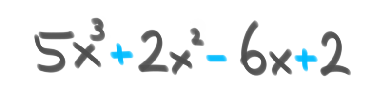

Just like writing your very first `for` loop, understanding time complexity is an integral milestone to learning how to write efficient complex programs. Think of it as having a superpower that allows you to know exactly what type of program might be the most efficient in a particular situation - before even running a single line of code.

The fundamental concepts of complexity analysis are well worth studying. You'll be able to better understand how the code you're writing will interact with the program's input, and as a result, you'll spend a lot less wasted time writing slow and problematic code. It won't take long to go over all you need to know in order to start writing more efficient programs - in fact, we can do it in about fifteen minutes. You can go grab a coffee right now (or tea, if that's your thing) and I'll take you through it before your coffee break is over. Go ahead, I'll wait.

All set? Let's do it!

## What is "time complexity" anyway

The time complexity of an algorithm is an __approximation__ of how long that algorithm will take to process some input. It describes the efficiency of the algorithm by the magnitude of its operations. This is different than the number of times an operation repeats; I'll expand on that later. Generally, the fewer operations the algorithm has, the faster it will be.

We write about time complexity using [Big O notation](https://en.wikipedia.org/wiki/Big_O_notation), which looks something like _O_(_n_). There's rather a lot of math involved in its formal definition, but informally we can say that Big O notation gives us our algorithm's approximate run time in the __worst case__, or in other words, its upper bound.<sup>[[2](#references)]</sup> It is inherently relative and comparative.<sup>[[3](#references)]</sup> We're describing the algorithm's efficiency relative to the increasing size of its input data, _n_. If the input is a string, then _n_ is the length of the string. If it's a list of integers, _n_ is the length of the list.

It's easiest to picture what Big O notation represents with a graph:



Here are the main important points to remember as you read the rest of this article:

- Time complexity is an approximation
- An algorithm's time complexity approximates its worst case run time

## Determining time complexity

There are different classes of complexity that we can use to quickly understand an algorithm. I'll illustrate some of these classes using nested loops and other examples.

## Polynomial time complexity

A __polynomial__, from the Greek _poly_ meaning "many," and Latin _nomen_ meaning "name," describes an expression comprised of constant variables, and addition, multiplication, and exponentiation to a non-negative integer power.<sup>[[4](#references)]</sup> That's a super math-y way to say that it contains variables usually denoted by letters and symbols that look like these:



The below classes describe polynomial algorithms. Some have food examples.

### Constant

A __constant time__ algorithm doesn't change its running time in response to the input data. No matter the size of the data it receives, the algorithm takes the same amount of time to run. We denote this as a time complexity of _O_(1).



Here's one example of a constant algorithm that takes the first item in a slice.

```go
func takeCupcake(cupcakes []int) int {
    return cupcakes[0]
}
```



With this constant-time algorithm, no matter how many cupcakes are on offer, you just get the first one. Oh well. Flavours are overrated anyway.

### Linear

The running duration of a __linear__ algorithm is constant. It will process the input in _n_ number of operations. This is often the best possible (most efficient) case for time complexity where all the data must be examined.



Here's an example of code with time complexity of _O_(_n_):

```go
func eatChips(bowlOfChips int) {
 for chip := 0; chip <= bowlOfChips; chip++ {
  // dip chip
 }
}
```

Here's another example of code with time complexity of _O_(_n_):

```go
func eatChips(bowlOfChips int) {
 for chip := 0; chip <= bowlOfChips; chip++ {
  // double dip chip
 }
}
```

It doesn't matter whether the code inside the loop executes once, twice, or any number of times. Both these loops process the input by a constant factor of _n_, and thus can be described as linear.



### Quadratic



Now here's an example of code with time complexity of _O_(_n_<sup>2</sup>):

```go
func pizzaDelivery(pizzas int) {
 for pizza := 0; pizza <= pizzas; pizza++ {
  // slice pizza
  for slice := 0; slice <= pizza; slice++ {
   // eat slice of pizza
  }
 }
}
```

Because there are two nested loops, or nested linear operations, the algorithm process the input _n_<sup>2</sup> times.

### Cubic



Extending on the previous example, this code with three nested loops has time complexity of _O_(_n_<sup>3</sup>):

```go
func pizzaDelivery(boxesDelivered int) {
 for pizzaBox := 0; pizzaBox <= boxesDelivered; pizzaBox++ {
  // open box
  for pizza := 0; pizza <= pizzaBox; pizza++ {
   // slice pizza
   for slice := 0; slice <= pizza; slice++ {
    // eat slice of pizza
   }
  }
 }
}
```



### Logarithmic

A __logarithmic__ algorithm is one that reduces the size of the input at every step.
We denote this time complexity as _O_(log _n_), where __log__, the logarithm function, is this shape:



One example of this is a [binary search algorithm](https://en.wikipedia.org/wiki/Binary_search_algorithm) that finds the position of an element within a sorted array. Here's how it would work, assuming we're trying to find the element _x_:

1. If _x_ matches the middle element _m_ of the array, return the position of _m_
2. If _x_ doesn't match _m_, see if _m_ is larger or smaller than _x_
    - If larger, discard all array items greater than _m_
    - If smaller, discard all array items smaller than _m_
3. Continue by repeating steps 1 and 2 on the remaining array until _x_ is found

I find the clearest analogy for understanding binary search is imagining the process of locating a book in a bookstore aisle. If the books are organized by author's last name and you want to find "Terry Pratchett," you know you need to look for the "P" section.

You can approach the shelf at any point along the aisle and look at the author's last name there. If you're looking at a book by Neil Gaiman, you know you can ignore all the rest of the books to your left, since no letters that come before "G" in the alphabet happen to be "P." You would then move down the aisle to the right any amount, and repeat this process until you've found the Terry Pratchett section, which should be rather sizable if you're at any decent bookstore because wow did he write a lot of books.

### Quasilinear



Often seen with sorting algorithms, the time complexity _O_(_n_ log _n_) can describe a data structure where each operation takes _O_(log _n_) time. One example of this is [quick sort](https://en.wikipedia.org/wiki/Quicksort), a divide-and-conquer algorithm.

Quick sort works by dividing up an unsorted array into smaller chunks that are easier to process. It sorts the sub-arrays, and thus the whole array. Think about it like trying to put a deck of cards in order. It's faster if you split up the cards and get five friends to help you.

### Non-polynomial time complexity

The below classes of algorithms are non-polynomial.

### Factorial



An algorithm with time complexity _O_(_n_!) often iterates through all permutations of the input elements. One common example is a [brute-force search](https://en.wikipedia.org/wiki/Brute-force_search) seen in the [travelling salesman problem](https://en.wikipedia.org/wiki/Travelling_salesman_problem#Computing_a_solution). It tries to find the least costly path between a number of points by enumerating all possible permutations and finding the ones with the lowest cost.

### Exponential

An __exponential__ algorithm often also iterates through all subsets of the input elements. It is denoted _O_(2<sup>_n_</sup>) and is often seen in brute-force algorithms. It is similar to factorial time except in its rate of growth, which as you may not be surprised to hear, is exponential. The larger the data set, the more steep the curve becomes.



In cryptography, a brute-force attack may systematically check all possible elements of a password by iterating through subsets. Using an exponential algorithm to do this, it becomes incredibly resource-expensive to brute-force crack a long password versus a shorter one. This is one reason that a long password is considered more secure than a shorter one.

There are further time complexity classes less commonly seen that I won't cover here, but you can read about these and find examples in [this handy table](https://en.wikipedia.org/wiki/Time_complexity#Table_of_common_time_complexities).

### Recursion time complexity

As I described in my article [explaining recursion using apple pie](/blog/understanding-array.prototype.reduce-and-recursion-using-apple-pie/), a recursive function calls itself under specified conditions. Its time complexity depends on how many times the function is called and the time complexity of a single function call. In other words, it's the product of the number of times the function runs and a single execution's time complexity.

Here's a recursive function that eats pies until no pies are left:

```go
func eatPies(pies int) int {
 if pies == 0 {
  return pies
 }
 return eatPies(pies - 1)
}
```

The time complexity of a single execution is constant. No matter how many pies are input, the program will do the same thing: check to see if the input is 0. If so, return, and if not, call itself with one fewer pie.

The initial number of pies could be any number, and we need to process all of them, so we can describe the input as _n_. Thus, the time complexity of this recursive function is the product _O_(_n_).



### Worst case time complexity

So far, we've talked about the time complexity of a few nested loops and some code examples. Most algorithms, however, are built from many combinations of these. How do we determine the time complexity of an algorithm containing many of these elements strung together?

Easy. We can describe the total time complexity of the algorithm by finding the largest complexity among all of its parts. This is because the slowest part of the code is the bottleneck, and time complexity is concerned with describing the worst case for the algorithm's run time.

Say we have a program for an office party. If our program looks like this:

```go
package main

import "fmt"

func takeCupcake(cupcakes []int) int {
 fmt.Println("Have cupcake number",cupcakes[0])
 return cupcakes[0]
}

func eatChips(bowlOfChips int) {
 fmt.Println("Have some chips!")
 for chip := 0; chip <= bowlOfChips; chip++ {
  // dip chip
 }
 fmt.Println("No more chips.")
}

func pizzaDelivery(boxesDelivered int) {
 fmt.Println("Pizza is here!")
 for pizzaBox := 0; pizzaBox <= boxesDelivered; pizzaBox++ {
  // open box
  for pizza := 0; pizza <= pizzaBox; pizza++ {
   // slice pizza
   for slice := 0; slice <= pizza; slice++ {
    // eat slice of pizza
   }
  }
 }
 fmt.Println("Pizza is gone.")
}

func eatPies(pies int) int {
 if pies == 0 {
  fmt.Println("Someone ate all the pies!")
  return pies
 }
 fmt.Println("Eating pie...")
 return eatPies(pies - 1)
}

func main() {
 takeCupcake([]int{1, 2, 3})
 eatChips(23)
 pizzaDelivery(3)
 eatPies(3)
 fmt.Println("Food gone. Back to work!")
}
```

We can describe the time complexity of all the code by the complexity of its most complex part. This program is made up of functions we've already seen, with the following time complexity classes:

| Function        | Class              | Big O                |
| --------------- | ------------------ | -------------------- |
| `takeCupcake`   | constant           | _O_(1)               |
| `eatChips`      | linear             | _O_(_n_)             |
| `pizzaDelivery` | cubic              | _O_(_n_<sup>3</sup>) |
| `eatPies`       | linear (recursive) | _O_(_n_)             |

To describe the time complexity of the entire office party program, we choose the worst case. This program would have the time complexity _O_(_n_<sup>3</sup>).

Here's the office party soundtrack, just for fun.

```bash
Have cupcake number 1
Have some chips!
No more chips.
Pizza is here!
Pizza is gone.
Eating pie...
Eating pie...
Eating pie...
Someone ate all the pies!
Food gone. Back to work!
```

## P vs NP, NP-complete, and NP-hard

You may come across these terms in your explorations of time complexity. Informally, __P__ (for Polynomial time), is a class of problems that is quick to solve. __NP__, for Nondeterministic Polynomial time, is a class of problems where the answer can be quickly verified in polynomial time. NP encompasses P, but also another class of problems called __NP-complete__, for which no fast solution is known.<sup>[[5](#references)]</sup> Outside of NP but still including NP-complete is yet another class called __NP-hard__, which includes problems that no one has been able to verifiably solve with polynomial algorithms.<sup>[[6](#references)]</sup>



[P versus NP](https://en.wikipedia.org/wiki/P_versus_NP_problem) is an unsolved, open question in computer science.

Anyway, you don't generally need to know about NP and NP-hard problems to begin taking advantage of understanding time complexity. They're a whole other Pandora's box.

## Approximate the efficiency of an algorithm before you write the code

So far, we've identified some different time complexity classes and how we might determine which one an algorithm falls into. So how does this help us before we've written any code to evaluate?

By combining a little knowledge of time complexity with an awareness of the size of our input data, we can take a guess at an efficient algorithm for processing our data within a given time constraint. We can base our estimation on the fact that a modern computer can perform some hundreds of millions of operations in a second.<sup>[[1](#references)]</sup> The following table from the [Competitive Programmer's Handbook](#references) offers some estimates on required time complexity to process the respective input size in a time limit of one second.

| Input size         | Required time complexity for 1s processing time |
| ------------------ | ----------------------------------------------- |
| n ≤ 10             | _O_(_n_!)                                       |
| n ≤ 20             | _O_(2<sup>_n_</sup>)                            |
| n ≤ 500            | _O_(_n_<sup>3</sup>)                            |
| n ≤ 5000           | _O_(_n_<sup>2</sup>)                            |
| n ≤ 10<sup>6</sup> | _O_(_n_ log _n_) or _O_(_n_)                    |
| n is large         | _O_(1) or _O_(log _n_)                          |

Keep in mind that time complexity is an approximation, and not a guarantee. We can save a lot of time and effort by immediately ruling out algorithm designs that are unlikely to suit our constraints, but we must also consider that Big O notation doesn't account for __constant factors__. Here's some code to illustrate.

The following two algorithms both have _O_(_n_) time complexity.

```go
func makeCoffee(scoops int) {
 for scoop := 0; scoop <= scoops; scoop++ {
  // add instant coffee
 }
}
```

```go
func makeStrongCoffee(scoops int) {
 for scoop := 0; scoop <= 3*scoops; scoop++ {
  // add instant coffee
 }
}
```

The first function makes a cup of coffee with the number of scoops we ask for. The second function also makes a cup of coffee, but it triples the number of scoops we ask for. To see an illustrative example, let's ask both these functions for a cup of coffee with a million scoops.

Here's the output of the Go test:

```sh
Benchmark_makeCoffee-4          1000000000               0.29 ns/op
Benchmark_makeStrongCoffee-4    1000000000               0.86 ns/op
```

Our first function, `makeCoffee`, completed in an average 0.29 nanoseconds. Our second function, `makeStrongCoffee`, completed in an average of 0.86 nanoseconds. While those may both seem like pretty small numbers, consider that the stronger coffee took near three times longer to make. This should make sense intuitively, since we asked it to triple the scoops. Big O notation alone wouldn't tell you this, since the constant factor of the tripled scoops isn't accounted for.

## Improve time complexity of existing code

Becoming familiar with time complexity gives us the opportunity to write code, or refactor code, to be more efficient. To illustrate, I'll give a concrete example of one way we can refactor a bit of code to improve its time complexity.

Let's say a bunch of people at the office want some pie. Some people want pie more than others. The amount that everyone wants some pie is represented by an `int` > 0:

```go
diners := []int{2, 88, 87, 16, 42, 10, 34, 1, 43, 56}
```

Unfortunately, we're bootstrapped and there are only three forks to go around. Since we're a cooperative bunch, the three people who want pie the most will receive the forks to eat it with. Even though they've all agreed on this, no one seems to want to sort themselves out and line up in an orderly fashion, so we'll have to make do with everybody jumbled about.

Without sorting the list of diners, return the three largest integers in the slice.

Here's a function that solves this problem and has _O_(_n_<sup>2</sup>) time complexity:

```go
func giveForks(diners []int) []int {
 // make a slice to store diners who will receive forks
 var withForks []int
 // loop over three forks
 for i := 1; i <= 3; i++ {
  // variables to keep track of the highest integer and where it is
  var max, maxIndex int
  // loop over the diners slice
  for n := range diners {
   // if this integer is higher than max, update max and maxIndex
   if diners[n] > max {
    max = diners[n]
    maxIndex = n
   }
  }
  // remove the highest integer from the diners slice for the next loop
  diners = append(diners[:maxIndex], diners[maxIndex+1:]...)
  // keep track of who gets a fork
  withForks = append(withForks, max)
 }
 return withForks
}
```

This program works, and eventually returns diners `[88 87 56]`. Everyone gets a little impatient while it's running though, since it takes rather a long time (about 120 nanoseconds) just to hand out three forks, and the pie's getting cold. How could we improve it?

By thinking about our approach in a slightly different way, we can refactor this program to have _O_(_n_) time complexity:

```go
func giveForks(diners []int) []int {
 // make a slice to store diners who will receive forks
 var withForks []int
 // create variables for each fork
 var first, second, third int
 // loop over the diners
 for i := range diners {
  // assign the forks
  if diners[i] > first {
   third = second
   second = first
   first = diners[i]
  } else if diners[i] > second {
   third = second
   second = diners[i]
  } else if diners[i] > third {
   third = diners[i]
  }
 }
 // list the final result of who gets a fork
 withForks = append(withForks, first, second, third)
 return withForks
}
```

Here's how the new program works:

Initially, diner `2` (the first in the list) is assigned the `first` fork. The other forks remain unassigned.

Then, diner `88` is assigned the first fork instead. Diner `2` gets the `second` one.

Diner `87` isn't greater than `first` which is currently `88`, but it is greater than `2` who has the `second` fork. So, the `second` fork goes to `87`. Diner `2` gets the `third` fork.

Continuing in this violent and rapid fork exchange, diner `16` is then assigned the `third` fork instead of `2`, and so on.

We can add a print statement in the loop to see how the fork assignments play out:

```sh
0 0 0
2 0 0
88 2 0
88 87 2
88 87 16
88 87 42
88 87 42
88 87 42
88 87 42
88 87 43
[88 87 56]
```

This program is much faster, and the whole epic struggle for fork domination is over in 47 nanoseconds.

As you can see, with a little change in perspective and some refactoring, we've made this simple bit of code faster and more efficient.

Well, it looks like our fifteen minute coffee break is up! I hope I've given you a comprehensive introduction to calculating time complexity. Time to get back to work, hopefully applying your new knowledge to write more effective code! Or maybe just sound smart at your next office party. :)

## References

 "If I have seen further it is by standing on the shoulders of Giants." --Isaac Newton, 1675

 1. Antti Laaksonen. _[Competitive Programmer's Handbook (pdf)](https://cses.fi/book.pdf),_ 2017
 2. Wikipedia: [Big O notation](https://en.wikipedia.org/wiki/Big_O_notation)
 3. StackOverflow: [What is a plain English explanation of “Big O” notation?](https://stackoverflow.com/a/487278)
 4. Wikipedia: [Polynomial](https://en.wikipedia.org/wiki/Polynomial)
 5. Wikipedia: [NP-completeness](https://en.wikipedia.org/wiki/NP-completeness)
 6. Wikipedia: [NP-hardness](https://en.wikipedia.org/wiki/NP-hardness)
 7. [Desmos graph calculator](https://www.desmos.com/)
