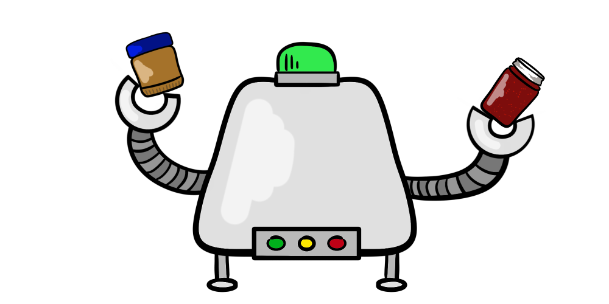
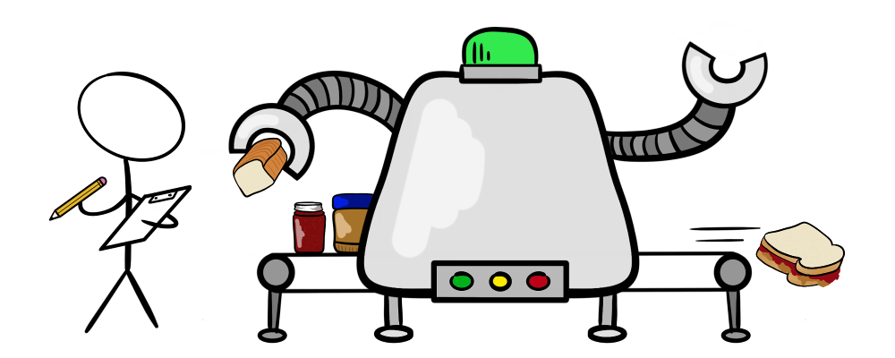

I've spent the last couple years as a solo freelance developer. Comparing this experience to previously working in companies, I've noticed that those of us who work alone can have fewer iterative opportunities for improvement than developers who work on teams. Integral to having opportunities to improve is the concept of a short feedback loop: a process of incorporating new learning from observation and previous experience continuously over a short period of time. This process has to be _manufactured_ by people working mostly alone, instead of, as is often the case, _adopted_ when you join a team.

In this post I hope to share what I've learned about setting yourself up to improve quickly and continuously as a solo coder.

## About feedback loops

United States Air Force Colonel John Boyd developed the concept of the [OODA loop](https://en.wikipedia.org/wiki/OODA_loop), OODA being an acronym for _observe, orient, decide, act_. In military operations, this illustrates a process of decision-making based on the constant ingestion of new information:

__Observe:__ Obtain raw information about unfolding circumstances and the current environment.
__Orient:__ Put raw observations in context. Consider such things as relevancy to the current situation and previously gained knowledge and expertise.
__Decide:__ Make a plan for moving towards your goal.
__Act:__ Execute the plan.

Since it's a loop, the _act_ stage leads directly back into the _observe_ stage. This is the critical "feed back" concept that enables increasingly successful iterations. It's widely applicable beyond military operations - you may recognize it as the origin of the [PDCA](https://en.wikipedia.org/wiki/PDCA) (plan-do-check-act) method.

I like the OODA loop for being a succinct illustration of a general feedback loop. Many concepts and working methods build on the idea of feedback loops, including [DevOps](https://en.wikipedia.org/wiki/DevOps) and [Agile software development](https://en.wikipedia.org/wiki/Agile_software_development) methods.

### Development team feedback loop

Let's look at what some components of a feedback loop for a developer on a team might look like:

1. Direction from product owners or reviews from users
2. Daily scrum/standup with whole team
3. Prioritization with developer team
4. Individual coding and testing
5. Peer code review
6. Deployment and performance monitoring

Implicit in these steps is the support of co-workers and management - in other words, someone to answer to. How can a solo freelance developer create a similar environment of accountability?

### Solo developer feedback loop

Here are some possible steps that an individual freelance developer can implement to create a short feedback loop:

1. Build discipline
1. Clarify concrete top-level goals
1. Prioritize and plan mid-level and low-level goals
1. Automate your work
1. Block out time for code review
1. Block out time for process review
1. Update your goals and processes with the results of your reviews

I'll cover each of these stages in detail below.

## Build discipline

More of a prerequisite than a stage in itself, building discipline is what enables our short feedback loop to work. Nothing else in this article will be helpful unless we have the skill to do something we don't want to do. Discipline is most certainly a skill. It can be learned, trained, and improved just like any other.

Why is discipline so important? Because when we're crunching to get a project completed this Friday evening, we're not going to want to write a good commit message. We're not going to want to clean up the code comments. We just want to see the darn thing go, _Hello, git push -f_. It's in those moments that discipline enables us to not miss an opportunity to practice, learn, and improve our work process. Discipline helps us avoid Friday night commits that turn into Monday morning `git reset --hard`s.

## Clarify concrete top-level goals

Whether working for a client or bootstrapping our own best-new-app-ever, we won't be able to measure any progress or improvements without something to measure them against.

When I'm discussing a new project with a client, I always speak in terms of concrete achievements. This could take the form of accomplishing a specific feature by a certain date, or deciding what the MVP looks like to a user. This is as much to my benefit as my client's. By agreeing, in writing, _what_ will be achieved and _when_, my client and I have clearly defined top-level goals and can both assess how the project is progressing. When I'm working for myself, I treat myself as I would a client. I make a commitment, in writing, describing what will be achieved, and when. This can be something as simple as a goals list for the week, or as detailed as a kanban board.

The point of having a concrete goal, however, is not to stick to it at all costs. It's important to set an expectation, with ourselves and with our clients, that the goals will be revisited at mutually-agreeable dates over the course of the project. This enables the all-important "feed back" part of the loop.

## Prioritize and plan mid-level and low-level goals

Few goals are achieved all in one step. Even the simple process of making a peanut butter and jelly sandwich (a favourite computer programming [teaching example](https://www.youtube.com/watch?v=y62zj9ozPOM&t=1016s)) can be broken down into successively smaller, more precise instructions. While we humans may not require the granularity that a computer program does, goals that are chunked into time-boxed, achievable steps are much more easily digested. 🥪

Start with the mid-level goals, and make each step concrete. If the goal is to release a new open source web app, for example, the steps might look like this:

1. Complete app JavaScript
2. Create front end and stylesheet
3. Do local tests
4. Set up cloud server
5. Deploy app to cloud
6. Do tests
7. Add repository to GitHub
8. Post on Hacker News
9. Profit!!!

Each of the above examples encapsulates many smaller, low-level goals - we can think of these as our to-do list items. For example, "Set up cloud server" might involve:

1. Research cloud providers
2. Decide on service and sign up
3. Set up server/instance
4. Add integrations
5. Test deployment

Our parameters for chunk sizes and what constitutes a "step" may be different from one another, and will likely change from project to project. If your mid-level and low-level steps clearly define a concrete path for achieving the top-level goals you set, then you're in good shape. Later on, evaluating the decision process that brought us to these mid-level and low-level goals enables us to bring our feedback loop full circle.

## Automate your work

I recently read a great article entitled [Manual Work is a Bug](https://queue.acm.org/detail.cfm?id=3197520). It discusses a process by which successful developers document and eventually automate their work. The beauty of this idea is in its simplicity. By writing down the things we do manually, we're able to correct and refine our processes. By refining our processes, we can more easily translate them into code snippets and scripts. With a collection of scripts that we can string together, we can automate our work.

Automating work isn't only about saving time. It reduces haven't-had-my-coffee-yet errors, minimizes cognitive load allowing more room for creativity, and allows our processes to be repeatable across collaborators and projects. It help shorten our feedback loop by ensuring we aren't doing the same thing three times in three different ways.

We can begin to automate by starting our own personal wiki. If we build a habit of writing down every manual thing we do, no matter how basic it may seem at the time, we give ourselves more opportunities to spot patterns, and thus possible integrations and improvements.

The first time we do something manually, we write out the steps. The second time, we follow the steps. This gives us the opportunity to correct and refine them based on what we've learned since the first time. Over successive iterations, we might replace parts of manual commands with variables; we might find handy snippets of bash scripts that automate just a part of our task. As long as we keep revising and improving our personal wiki, we're moving towards automation.

## Block out time for code review

It's all too easy to commit messy code when we work alone. We think, _who's going to see it? I'll fix it later._ Each time that happens, though, we're building a habit. It's a bad one.

Working alone means there's no one likely to give feedback on our commits when we're doing something that doesn't make sense, or that could be improved. Instead, we have to actively seek out opportunities to improve. Open source communities are amazing for this. There's a wealth of information available to us in terms of coding styles, examples of refactored code, and a smorgasbord of snippets that achieve that-thing-we-were-trying-to-do but in fewer lines. We can learn all we please, if we just block out the time to do it.

Schedule your own code review at a time that makes sense for you and the project you're working on. This might be each time you finish a fix or feature, or at regular intervals daily or weekly. If you have someone who can help, book them. There are also a great many organizations that host chatrooms full of people happy to lend a hand: [freeCodeCamp](https://www.freecodecamp.org/) and the [OWASP Web Security Testing Guide](https://github.com/OWASP/wstg), to name a couple.

Do some research on basic best practices for what you're working on. Set yourself a time limit though, and take what you read with a grain of salt. There's a lot of rabbit holes in that field. As a starting point, I'd recommend learning about DRY code, and watching [Uncle Bob demand professionalism in software development](https://www.youtube.com/watch?v=p0O1VVqRSK0&feature=youtu.be&t=330).

### Code review checklist

Here's my personal code review checklist, based off some general best practices. Feel free to use it as a starting point for your own!

> **Victoria's Code Review Extravaganza!**
>
> - [ ] This solves a high-priority item.
> - [ ] This is a complete implementation that follows the specification.
> - [ ] Off-topic changes were not included and have been added to backlog.
> - [ ] Variable names are meaningful and there are no magic numbers.
> - [ ] Correct and useful error messages are returned at every opportunity.
> - [ ] No debugging print statements were left in.
> - [ ] This code is DRY and modular.
> - [ ] This code is secure. Private and public code are well separated.
> - [ ] This code is its own documentation, or the documentation is up to date.
> - [ ] A five-year-old could follow this, seriously it's that readable.
> - [ ] Unit tests successfully pass.
> - [ ] Master was merged into the branch and tested.
> - [ ] Formatting follows style guidelines.
> - [ ] I cannot find any further edge cases or known defects.
> - [ ] I would be happy if this code was publicly attributed to me.
> - [ ] I fully understand what the code does and the impact of the changes I made.
> - [ ] I actually verified that it actually does what I said it does.

[Here is an excellent example](https://dev.to/gonedark/writing-clean-code) of cleaning up code with some of the above points in mind.

## Block out time for process review

Just as we learn from reviewing our code, we refine our processes by reviewing them as well. Process review is most beneficial when visited at regular intervals throughout the project, not just after the project's completion. For short-term projects, a good starting point for scheduling process reviews is at each half-mark - once midway through, and again after completion. Long-term projects may have reviews at each quarter-mark.

### Process review questions

Process review can be as simple as a short list of questions:

1. What were my top-level goals for this period? Did I meet them?
2. What were my mid-level and low-level goals for this period? Did I meet them?
3. Would I have been better served with different or more specific goals? Why?
4. Did I successfully remove or automate obstacles?
5. Did I stick to my code review schedule? Why or why not?
6. How might I remove obstacles next time?

Setting aside dedicated time for our process review can help us to answer questions like these thoughtfully and honestly. This allows us to squeeze out every bit of learning we can from our review, helping to shorten our feedback loop.

## Update your goals and processes with the results of your reviews

All the performance data in the world is no good to us if we don't put it into practice. With each successive code review, we can refine and add to our checklist. With what we learn from each process review, we can fine tune and improve our processes. The more we can invent concrete and observable ways to implement our learning, the more success we'll have.

Making a conscious effort to utilize and practice the things we've learned is the final, vital, component of our feedback loop. The more often we incorporate new learning, the shorter our loop becomes, allowing us to improve that much faster.
