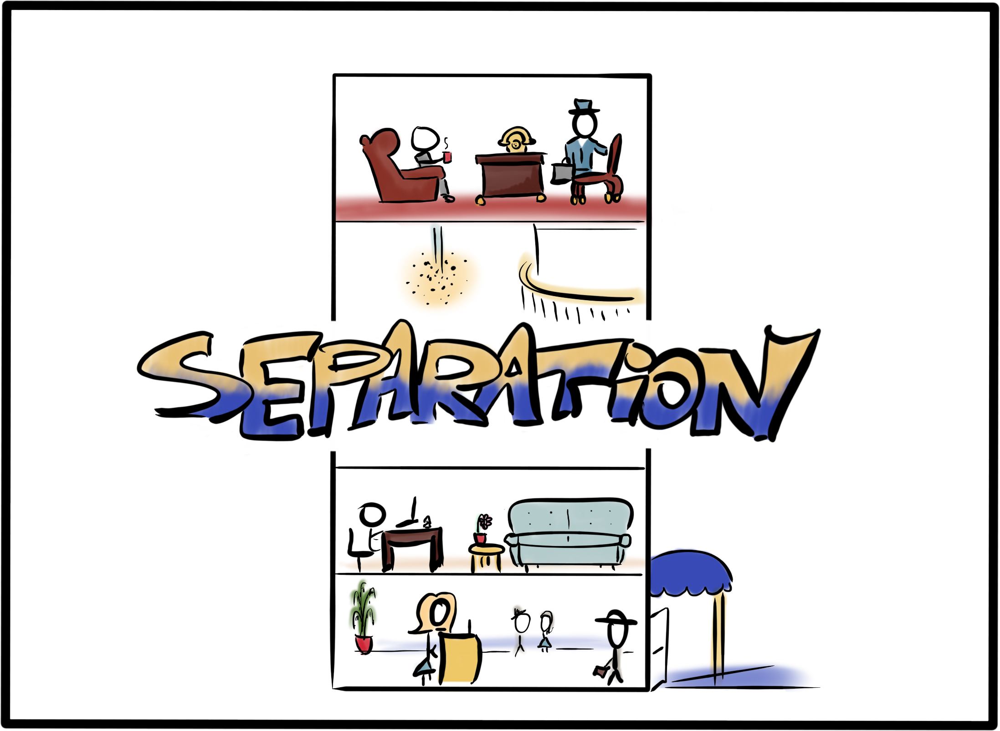
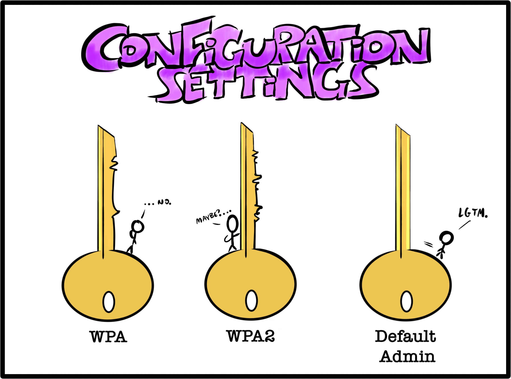
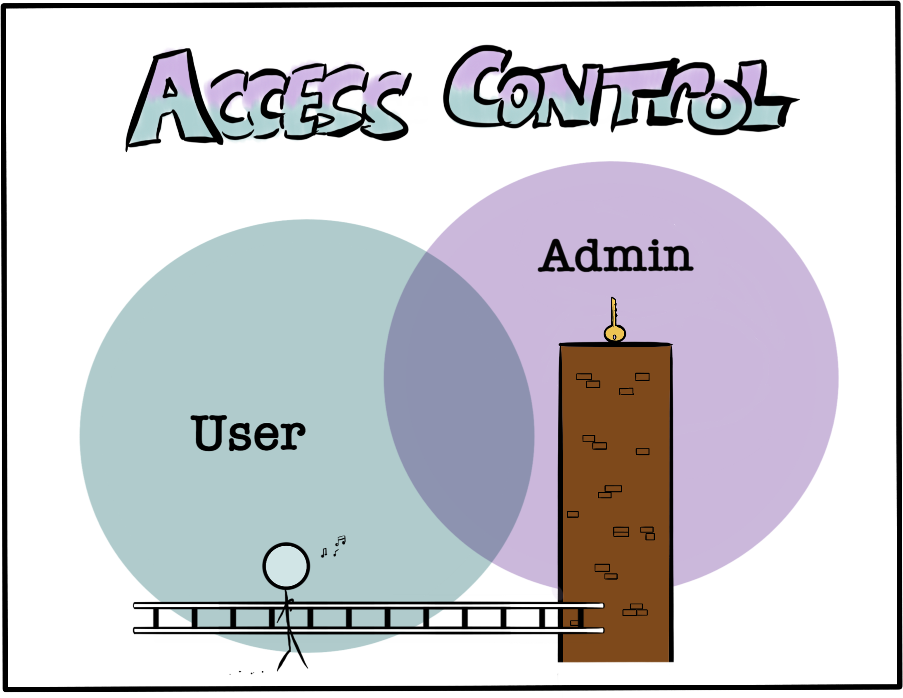

Software developers today are encouraged to focus on building, and that's a great thing. There's the benefit of maker culture, an attitude of "always be shipping," open source collaboration, and a bevy of apps that help you prioritize and execute with maximum efficiency. It's in an environment of constant creation, where both teams and solo entrepreneurs can be maximally productive.

Sometimes, this breakneck-speed productivity shows its downsides.

A lack of awareness of security seems to lead to a lack of prioritization of tasks that don't directly support bringing the product to launch. The market seems to have made it more important to launch a usable product than a secure one, with the prevailing attitude being, "we can do the security stuff later."

Cobbling together a foundation based more on expediency than longevity is a bad way to build applications and a great way to build security debt. Security debt, like technical debt, amasses when developers make decisions that can make it more difficult to secure the application later on. If you're familiar with the concept of "pushing left" (or if you read my [article about sensitive data exposure](/blog/hackers-are-googling-your-plain-text-passwords-preventing-sensitive-data-exposure/)), you'll know that when it comes to security, sometimes there isn't a version of "later" that isn't _too_ late. It's a shame, especially since following some basic security practices with high benefit yield early on in the development process doesn't take significantly more time than _not_ following them. Often, it comes down to having some basic but important knowledge that enables making the more secure decision.

While application architecture specifics vary, there are a few basic principles you can commonly apply. This article will provide a high-level overview of areas that I hope will help point developers in the right direction.

There must be a reason you call it application "architecture." I like to think it's because the architecture of software is similar in some basic ways to the architecture of a building. (Or at least, in my absolute zero building-building expertise, how I imagine a building to be built.) Here's how I like to summarize three basic points of secure application architecture:

1. Separated storage
2. Customized configuration
3. Controlled access and user scope

This is only a jumping-off point meant to get you started on the right foot; a complete picture of a fully-realized application's security posture includes areas outside the scope of this article, including authentication, logging and monitoring, testing, and perhaps meeting compliance standards.

## 1. Separated storage

From a security standpoint, the concept of separation refers to storing files that serve different purposes in different places. When you're constructing your building and deciding where all the rooms go, you similarly create the lobby on the ground floor and place administrative offices on higher floors, perhaps off the main path. While both are rooms, you understand that they serve different purposes, have different functional needs, and possibly very different security requirements.



When it comes to your files, the benefit is perhaps easiest to understand if you consider a simple file structure:

```txt
application/
 ├───html/
 │   └───index.html
 ├───assets/
 │   ├───images/
 │   │   ├───rainbows.jpg
 │   │   └───unicorns.jpg
 │   └───style.css
 └───super-secret-configurations/
     └───master-keys.txt
```

In this simplified example, let's say that all your application's images are stored in the `application/assets/images/` directory. When one of your users creates a profile and uploads their picture to it, this picture is also stored in this folder. Makes sense, right? It's an image, and that's where the images go. What's the issue?

If you're familiar with navigating a file structure in a terminal, you may have seen this syntax before: `../../`. The two dots are a handy way of saying, "go up one directory." If you execute the command `cd ../../` in the `images/` directory of the simple file structure above, you'd go up into `assets/`, then up again to the root directory, `application/`. This is a problem because of a wee little vulnerability dubbed [path traversal](https://cwe.mitre.org/data/definitions/22.html).

While the dot syntax saves you some typing, it also introduces the interesting advantage of not actually needing to know what the parent directory is called in order to go to it. Consider an attack payload script, delivered into the `images/` folder of your insecure application via an uploaded file, that went up one directory using `cd ../` and then sent everything it found to the attacker, on repeat. Eventually, it would reach the root application directory and access the `super-secret-configurations/` folder. Not good.

While other measures should be in place to prevent path traversal and related user upload vulnerabilities, the simplest prevention by far is a separation of storage. Core application files and assets should not be combined with other data, and especially not with [user input](/blog/sql-injection-and-xss-what-white-hat-hackers-know-about-trusting-user-input/). It's best to keep user-uploaded files and activity logs (which may contain juicy data and can be vulnerable to injection attacks) separate from the main application.

Separation can be achieved in a few ways, such as by using a different server, different instance, separate IP range, or separate domain.

## 2. Customized configuration

[Security misconfiguration](https://github.com/OWASP/Top10/blob/cb5f8967bba106e14a350761ac4f93b8aec7f8fa/2017/en/0xa6-security-misconfiguration.md) is listed in the OWASP Top 10. A surprising number of very preventable security incidents occur because a server, firewall, or administrative account is running in production with default settings. Upon the opening of your new building, you'd hopefully be more careful to ensure you haven't left any keys in the locks.



Usually, the victims of attacks related to default settings aren't specifically targeted. Rather, they are found by automated scanning tools that attackers run over many possible targets, effectively prodding at many different systems to see if any roll over and expose some useful exploit. The automated nature of this attack means that it's important for you to review settings for every piece of your architecture. Even if an individual piece doesn't seem significant, it may provide a vulnerability that allows an attacker to use it as a gateway to your larger application.

In particular, examine architecture components for unattended areas such as:

- Default accounts, especially with default passwords, left in service;
- Example web pages, tutorial applications, or sample data left in the application;
- Unnecessary ports left in service, or ports left open to the Internet;
- Unrestricted permitted HTTP methods;
- Sensitive information stored in automated logs;
- Default configured permissions in managed services; and,
- Directory listings, or sensitive file types, left accessible by default.

This list isn't exhaustive. Specific architecture components, such as cloud storage or web servers, will have other configurable features that should be reviewed. In general, reduce the application's attack surface by using minimal architecture components. If you use fewer components or don't install modules you don't need, you'll have fewer possible attack entry points to configure and safeguard.

## 3. Controlled access and user scope

One of the more difficult security problems to test in an application is misconfigured access control. Automated testing tools have limited capability to find areas of an application that one user shouldn't be able to access. Thus, this is often left to manual testing or source code review to discover. By considering this vulnerability early on in the software development lifecycle when architectural decisions are being made, you reduce the risk that it becomes a problem that's harder to fix later. After all, you wouldn't simply leave your master keys out of reach on a high ledge and hope no one comes along with a ladder.



[Broken access control](https://github.com/OWASP/Top10/blob/master/2017/en/0xa5-broken-access-control.md) is listed in the OWASP Top 10, which goes into more detail on its various forms. As a simple example, consider an application with two levels of access: administrators and users. You want to build a new feature - the ability to moderate or ban users - with the intention that only administrators would be allowed to use it.

If you're aware of the possibility of access control misconfigurations or exploits, you may decide to build the moderation feature in a completely separate area from the user-accessible space, such as on a different domain, or as part of a model that users don't share. This greatly reduces the risk that an access control misconfiguration or elevation of privilege vulnerability might allow a user to improperly access the moderation feature later on.

Of course, robust access control in your application needs more support to be effective. Consider factors such as sensitive tokens, or keys passed as URL parameters, or whether a control fails securely or insecurely. Nevertheless, by considering authorization at the architectural stage, you can set yourself up to make further reinforcements easier to implement.

## Security basics for maximum benefit

Similar to avoiding racking up technical debt by choosing a well-vetted framework, developers can avoid security debt by becoming more aware of common vulnerabilities and the simple architectural decisions you can make to help mitigate them. For a much more detailed resource on how to bake security into your applications from the start, the [OWASP Application Security Verification Standard](https://github.com/OWASP/ASVS) is a robust guide.
