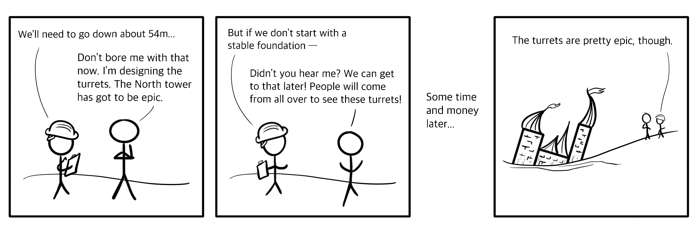

If you've ever watched a kid draw a treehouse, you have some idea of how applications are built when security isn't made a priority. It's far more fun to draw the tire swing, front porch, and swimming pool than to worry about how a ten-thousand-gallon bucket of water stays suspended in midair. With too much attention spent on fun and flashy features, foundations suffer.

Of course, spending undue hours building a back end like Fort Knox may not be necessary for your application, either. Being an advocate for security doesn't mean always wearing your tinfoil hat (although you do look dashing in it) but does mean building in an appropriate amount of security.

How much security is appropriate? The answer, frustratingly, is, "it depends." The right amount of security for your application depends on who's using it, what it does, and most importantly, what undesirable things it could be made to do. It takes some analysis to make decisions about the kinds of risks your application faces and how you'll prepare to handle them. Okay, now's a good time to don your tinfoil hat. Let's imagine the worst.

## Threat modeling: what's the worst that could happen

A _threat model_ is a stuffy term for the result of trying to imagine the worst things that could happen to an application. Using your imagination to assess risks (fittingly called _risk assessment_) is a conveniently non-destructive method for finding ways an application can be attacked. You won't need any tools; just an understanding of how the application might work, and a little imagination. You'll want to record your results with pen and paper. For the younger folks, that means the notes app on your phone.

A few different methodologies for application risk assessment can be found in the software world, including the in-depth [NIST Special Publication 800-30](https://csrc.nist.gov/publications/detail/sp/800-30/rev-1/final). Each method's framework has specific steps and output, and will go into various levels of detail when it comes to defining threats. If following a framework, first choose the one you're most likely to complete. You can always add more depth and detail from there.

Even informal risk assessments are beneficial. Typically taking the form of a set of questions, they may be oriented around possible threats, the impact to assets, or ways a vulnerability could be exploited. Here are some examples of questions addressing each orientation:

- What kind of adversary would want to break my app? What would they be after?
- If the control of _x_ fell into the wrong hands, what could an attacker do with it?
- Where could a _x_ vulnerability occur in my app?

A basic threat model explains the technical, business, and human considerations for each risk. It will typically detail:

- The vulnerabilities or components that can cause the risk
- The impact that a successful execution of the risk would have on the application
- The consequences for the application's users or organization

The result of a risk assessment exercise is your threat model; in other words, a list of things you would very much like not to occur. It is usually sorted in a hierarchy of risks, from the worst to the mildest. The worst risks have the most negative impact, and are most important to protect against. The mildest risks are the most acceptable - while still an undesirable outcome, they have the least negative impact on the application and users.

You can use this resulting hierarchy as a guide to determine how much of your cybersecurity efforts to apply to each risk area. An appropriate amount of security for your application will eliminate (where possible) or mitigate the worst risks.

## Pushing left

Although it sounds like a dance move meme, _pushing left_ refers instead to building in as much of your planned security as possible in the early stages of software development.

Building software is a lot like building a treehouse, just without the pleasant fresh air. You start with the basic supporting components, such as attaching a platform to a tree. Then comes the framing, walls, and roof, and finally, your rustic-modern Instagram-worthy wall hangings and deer bust.

The further along in the build process you are, the harder and more costly it becomes to make changes to a component that you've already installed. If you discover a problem with the walls only after the roof is put in place, you may need to change or remove the roof in order to fix it. Similar parallels can be drawn for software components, only without similar ease in detangling the attached parts.

In the case of a treehouse, it's rather impossible to start with decorations or even a roof, since you can't really suspend them in midair. In the case of software development, it is, unfortunately, possible to build many top-layer components and abstractions without a sufficient supporting architecture. A push-left approach views each additional layer as adding cost and complication. Pushing left means attempting to mitigate security risks as much as possible at each development stage before proceeding to the next.

## Building bottom-to-top

By considering your threat model in the early stages of developing your application, you reduce the chances of necessitating a costly remodel later on. You can make choices about architecture, components, and code that support the main security goals of your particular application.

While it's not possible to foresee all the functionality your application may one day need to support, it is possible to prepare a solid foundation that allows additional functionality to be added more securely. Building in appropriate security from the bottom to the top will help make mitigating security risks much easier in the future.
