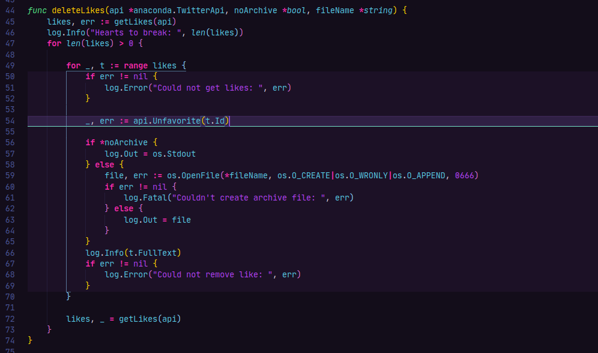

This article isn't going to tell you about saving your neck with a Roost stand, or your wrists with a split keyboard - [I've already done that](https://heronebag.com/blog/next-level-ergonomics-for-remote-work-developers/). This article is about saving your brain.

When I first began to program full time, I found myself constantly tired from the mental exertion. Programming is hard! Thankfully, you can take some solace in knowing it gets easier with practice, and with a great supporting cast. Some very nice folks who preceded us both came up with tools to make the difficult bits of communicating with computers much easier on our poor human meatbrains.

I invite you to explore these super helpful technical tools. They'll improve your development set up and alleviate much of the mental stress of programming. You soon won't believe you could have done without them.

## Not your average syntax highlighting

If you're still working with syntax highlighting that just picks out variable and class names for you, that's cute. Time to turn it up a notch.



In all seriousness, syntax highlighting can make it much easier to find what you're looking for on your screen: the current line, where your current code block starts and ends, or the absolute game-changing which-bracket-set-am-I-in highlight. I primarily use Visual Studio Code, but similar extensions can be found for the major text editors.

The theme pictured in Visual Studio Code above is [Kabukichō](https://github.com/victoriadrake/kabukicho-vscode). I made it.

## Use Git hooks

I previously brought you [an interactive pre-commit checklist in the style of infomercials](/blog/an-automatic-interactive-pre-commit-checklist-in-the-style-of-infomercials/) that's both fun and useful for reinforcing the quality of your commits. But that's not all!

Git hooks are scripts that run automatically at pre-determined points in your workflow. Use them well, and you can save a ton of brainpower. A `pre-commit` hook remembers to do things like lint and format code, and even runs local tests for you before you indelibly push something embarrassing. Hooks can be a little annoying to share (the `.git/hooks` directory isn't tracked and thus omitted when you clone or fork a repository) but there's a framework for that: the confusingly-named [pre-commit framework](https://pre-commit.com/), which allows you to create a sharable configuration file of Git hook plugins, not just for `pre-commit`.

I spend a majority of my time these days coding in Python, so here is my current `.pre-commit-config.yaml`:

```yaml

```

There are tons of [supported hooks](https://pre-commit.com/hooks.html) to explore.

## Use a type system

If you write in languages like Python and JavaScript, get yourself an early birthday present and start using a static type system. Not only will this help improve the way you think about code, it can help make type errors clear before running a single line.

For Python, I like using [mypy](https://github.com/python/mypy) for static type checking. You can set it up as a `pre-commit` hook (see above) and it's [supported in Visual Studio Code too](https://code.visualstudio.com/docs/python/linting#_mypy).

[TypeScript](https://www.typescriptlang.org/) is my preferred way to write JavaScript. You can run the compiler on the command line using Node.js (see [instructions in the repo](https://github.com/Microsoft/TypeScript)), it works pretty well [with Visual Studio Code](https://code.visualstudio.com/Docs/languages/typescript) out of the box, and of course there are multiple options for [extension integrations](https://code.visualstudio.com/Docs/languages/typescript#_typescript-extensions).

## Quit unnecessarily beating up your meatbrain

I mean, you wouldn't stand on your head all day to do your work. It would be rather inconvenient to read things upside down all the time (at least [until your brain adjusted](https://www.youtube.com/watch?v=jKUVpBJalNQ)), and in any case you'd likely get uncomfortably congested in short order. Working without taking advantage of the technical ergonomic tools I've given you today is a little like unnecessary inversion - why would you, if you don't have to?
