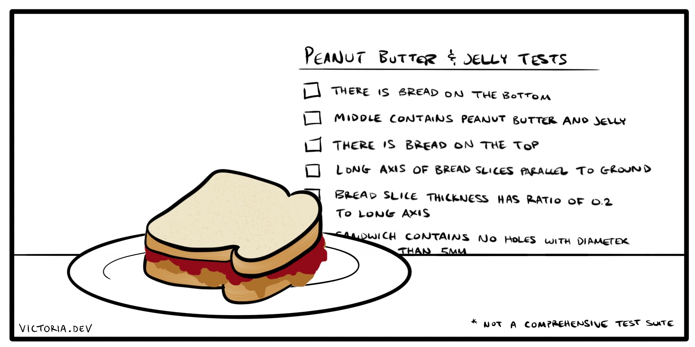

Done correctly, tests are one of your application's most valuable assets.

The Django framework in particular offers your team the opportunity to create an efficient testing practice. Based on the Python standard library `unittest`, proper tests in Django are fast to write, faster to run, and can offer you a seamless continuous integration solution for taking the pulse of your developing application.

With comprehensive tests, developers have higher confidence when pushing changes. I've seen firsthand in my own teams that good tests can boost development velocity as a direct result of a better developer experience.

In this article, I'll share my own experiences in building useful tests for Django applications, from the basics to the best possible execution. If you're using Django or building with it in your organization, you might like to read the rest of my [Django series](/tags/django/).

## What to test

Tests are extremely important. Far beyond simply letting you know if a function works, tests can form the basis of your team's understanding of how your application is _intended_ to work.

Here's the main goal: if you hit your head and forgot everything about how your application works tomorrow, you should be able to regain most of your understanding by reading and running the tests you write today.

Here are some questions that may be helpful to ask as you decide what to test:

- What is our customer supposed to be able to do?
- What is our customer _not_ supposed to be able to do?
- What should this method, view, or logical flow achieve?
- When, how, or where is this feature supposed to execute?

Tests that make sense for your application can help build developer confidence. With these sensible safeguards in place, developers make improvements more readily, and feel confident introducing innovative solutions to product needs. The result is an application that comes together faster, and features that are shipped often and with confidence.



## Where to put tests

If you only have a few tests, you may organize your test files similarly to [Django's default app template](https://docs.djangoproject.com/en/3.1/ref/django-admin/#startapp) by putting them all in a file called `tests.py`. This straightforward approach is best for smaller applications.

As your application grows, you may like to split your tests into different files, or test modules. One method is to use a directory to organize your files, such as `projectroot/app/tests/`. The name of each test file within that directory should begin with `test`, for example, `test_models.py`.

Besides being aptly named, Django will find these files using [built-in test discovery](https://docs.python.org/3/library/unittest.html#unittest-test-discovery) based on the `unittest` module. All files in your application with names that begin with `test` will be collected into a test suite.

This convenient test discovery allows you to place test files anywhere that makes sense for your application. As long as they're correctly named, Django's test utility can find and run them.

## How to document a test

Use [docstrings](https://www.python.org/dev/peps/pep-0257/) to explain what a test is intended to verify at a high level. For example:

```python
def test_create_user(self):
    """Creating a new user object should also create an associated profile object"""
    # ...
```

These docstrings help you quickly understand what a test is supposed to be doing. Besides navigating the codebase, this helps to make it obvious when a test doesn't verify what the docstring says it should.

Docstrings are also shown when the tests are being run, which can be helpful for logging and debugging.

## What a test needs to work

Django tests can be quickly set up using data created in the [`setUpTestData()` method](https://docs.djangoproject.com/en/3.1/topics/testing/tools/#django.test.TestCase.setUpTestData). You can use various approaches to create your test data, such as utilizing external files, or even hard-coding silly phrases or the names of your staff. Personally, I much prefer to use a fake-data-generation library, such as [`faker`](https://github.com/joke2k/faker/).

The proper set up of arbitrary testing data can help you ensure that you're testing your application functionality instead of accidentally testing test data. Because generators like `faker` add some degree of unexpectedness to your inputs, it can be more representative of real-world use.

Here is an example set up for a test:

```python
from django.test import TestCase
from faker import Faker

from app.models import MyModel, AnotherModel

fake = Faker()


class MyModelTest(TestCase):
    def setUpTestData(cls):
        """Quickly set up data for the whole TestCase"""
        cls.user_first = fake.first_name()
        cls.user_last = fake.last_name()

    def test_create_models(self):
        """Creating a MyModel object should also create AnotherModel object"""
        # In test methods, use the variables created above
        test_object = MyModel.objects.create(
            first_name=self.user_first,
            last_name=self.user_last,
            # ...
        )
        another_model = AnotherModel.objects.get(my_model=test_object)
        self.assertEqual(another_model.first_name, self.user_first)
        # ...
```

Tests pass or fail based on the outcome of the assertion methods. You can use [Python's `unittest` methods](https://docs.python.org/3/library/unittest.html#assert-methods), and [Django's assertion methods](https://docs.djangoproject.com/en/3.1/topics/testing/tools/#assertions).

For further guidance on writing tests, see [Testing in Django](https://docs.djangoproject.com/en/3.1/topics/testing/).

## Best possible execution for running your tests

Django's test suite is manually run with:

```shell
./manage.py test
```

I rarely run my Django tests this way.

The best, or most efficient, testing practice is one that occurs without you or your developers ever thinking, "I need to run the tests first." The beauty of Django's near-effortless test suite set up is that it can be seamlessly run as a part of regular developer activities. This could be in a pre-commit hook, or in a continuous integration or deployment workflow.

I've previously written about how to use pre-commit hooks to [improve your developer ergonomics](/posts/technical-ergonomics-for-the-efficient-developer/) and save your team some brainpower. Django's speedy tests can be run this way, and they become especially efficient if you can [run tests in parallel](https://docs.djangoproject.com/en/3.1/ref/django-admin/#cmdoption-test-parallel).

Tests that run as part of a CI/CD workflow, for example, [on pull requests with GitHub Actions](/posts/django-project-best-practices-to-keep-your-developers-happy/#continuous-testing-with-github-actions), require no regular effort from your developers to remember to run tests at all. I'm not sure how plainly I can put it -- this one's literally a no-brainer.

## Testing your way to a great Django application

Tests are extremely important, and underappreciated. They can catch logical errors in your application. They can help explain and validate how concepts and features of your product actually function. Best of all, tests can boost developer confidence and development velocity as a result.

The best tests are ones that are relevant, help to explain and define your application, and are run continuously without a second thought. I hope I've now shown you how testing in Django can help you to achieve these goals for your team!
