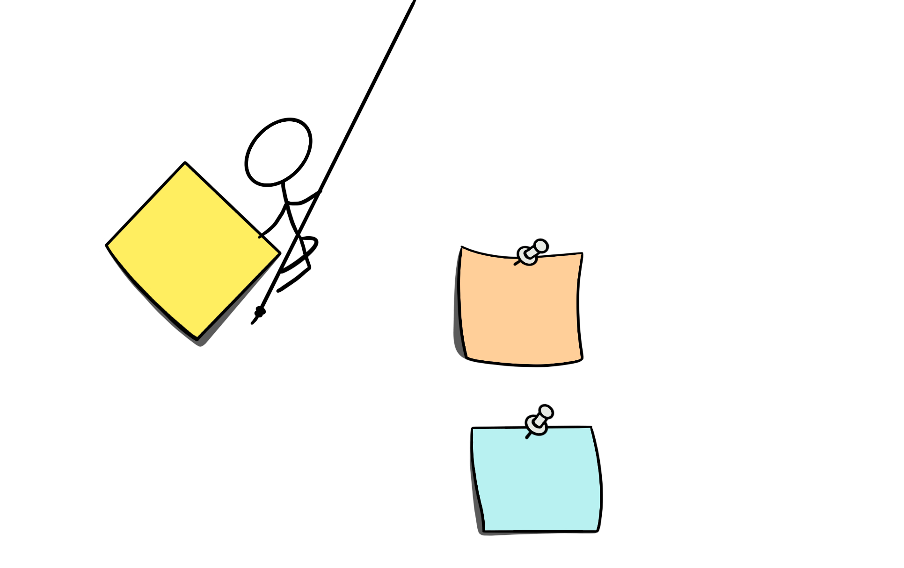
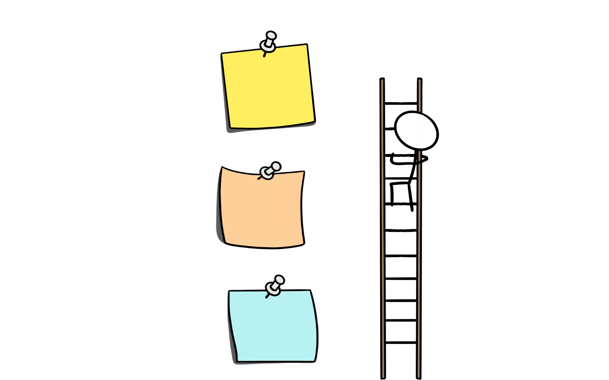

In the engineering teams I lead, “priority” has no plural form. This drives some people slightly crazy, especially those who like to hedge their bets with phrases like “top priorities” or “critical priorities.” But I’ve learned that the moment you allow multiple top priorities, you’ve essentially created zero priorities.

I discovered this the hard way while working with a team that was constantly context-switching between “urgent” projects. Everyone was busy, morale was decent, but we weren’t actually shipping much of value. During one particularly frustrating week, I counted seventeen different tasks that had been labeled as “high priority” by various stakeholders. Our standups felt like disaster reports, and I realized we’d created a system where being busy had become more important than being effective.

The solution turned out to be surprisingly simple, though not easy to implement: put everything into a single, ordered list where only one thing can be most important at any given time.

## The Radical Transparency of a Central List

Most teams I’ve encountered operate like a collection of individual to-do lists with some coordination meetings sprinkled on top. Engineering works on technical debt, product pushes for new features, leadership wants infrastructure improvements, and everyone optimizes their own piece of the puzzle. The result is a lot of activity that doesn’t add up to meaningful progress.

A single, centralized, prioritized list changes the entire dynamic. Everyone can see what’s actually being worked on, what’s coming next, and most importantly, what’s not getting done and why. This visibility creates natural conversations about trade-offs that simply don’t happen when work is siloed.

I’ve watched teams discover they were working on competing solutions to the same problem, simply because no one had a complete view of active work. Others realized they were delaying important projects because someone assumed “someone else” was handling the dependency. When everything is visible and ordered, these coordination problems become obvious and fixable.

The transparency also creates a different kind of accountability. When priorities are public and explicit, it becomes much harder to justify working on pet projects or avoiding difficult tasks. The list becomes a shared source of truth that guides decisions rather than each person interpreting priorities through their own lens.

## Autonomy Within Structure

One concern I hear frequently is that a single priority list will turn people into order-takers rather than creative problem-solvers. In practice, I’ve found exactly the opposite happens when you implement it correctly.

The key is encouraging people to choose the highest-priority task they can effectively tackle rather than assigning specific tasks to specific people. Someone might skip over the absolute top item because it requires domain knowledge they don’t have, but they can pick up the second or third item that lets them contribute meaningfully while learning something new.

This approach leverages the fact that your team members understand their own capabilities and growth goals better than you do. A senior engineer might choose to mentor a junior developer on a complex task. A frontend specialist might want to tackle a backend task to broaden their skills. These decisions create better outcomes in the long term than top-down task assignment while still maintaining focus on organizational priorities.

The autonomy comes from trusting people to make good decisions about how to contribute most effectively, while the structure comes from ensuring those contributions align with actual business needs.

## The Art of Making Yourself Redundant

If your team frequently asks you what they should work on next, you’ve accidentally created a bottleneck—and it's you. This is one of the most common scaling problems I see with engineering leaders who transition from individual contributor roles.

The goal is building a system where intelligent people can make good decisions without constant input from leadership. This requires making context painfully available—team goals, product strategy, architectural decisions, customer feedback, and anything else that influences prioritization should be accessible and current.

I’ve found that the difference between teams that scale smoothly and teams that hit velocity walls usually comes down to how well they’ve documented the reasoning behind decisions. When someone can understand not just what to build but why it matters and how it fits into the larger strategy, they can make smart trade-offs independently.

This redundancy becomes especially critical during high-pressure situations. When systems are down or deadlines are looming, you don’t want your team waiting for permission to take action. Teams that have practiced autonomous decision-making within clear constraints can respond quickly and effectively without requiring heroic coordination efforts.

## The Cultural Transformation

What surprises most leaders is how much this simple change affects team culture. When priorities are clear and transparent, several things happen that go far beyond improved task management.

First, political conversations about priority disappear. There’s no point in lobbying for your favorite project when the criteria for prioritization are explicit and the current order is visible to everyone. Energy that was spent on organizational maneuvering gets redirected toward actual work.

Second, people start thinking about their contributions differently. Instead of optimizing for individual productivity, they begin considering how their work fits into team objectives. This naturally leads to better collaboration and knowledge sharing.

Third, the team develops a shared sense of progress and momentum. When everyone can see important work getting completed in priority order, it creates a satisfying rhythm that isolated individual achievements can’t match.

## Implementation Reality

The biggest challenge isn’t creating the list—it’s maintaining the discipline to use it consistently. Teams often start strong but gradually drift back to multiple priority tracks when pressure increases or when compelling new opportunities arise.

I’ve learned to treat priority discipline like any other technical practice that requires ongoing attention. Schedule regular review sessions to reorder the list, have explicit discussions about what we’re choosing not to do, and consistently communicate why keeping a single-priority focus helps maintain development velocity.

The payoff: teams that ship more valuable work with less stress and confusion. When everyone understands what matters most and feels empowered to contribute effectively, both productivity and job satisfaction improve dramatically.

Most importantly, single-priority focus creates sustainable high performance rather than the boom-and-bust cycles that come from constantly shifting between competing urgent demands. Teams learn to work steadily toward important goals rather than reacting to whatever feels most pressing in the moment.