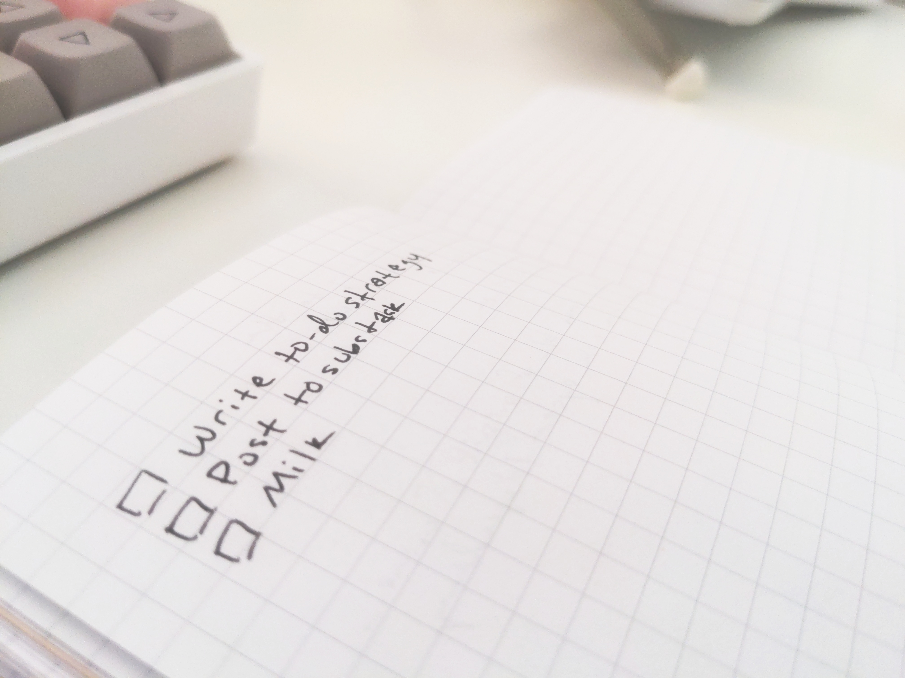

Coding up a to-do app may be the Hello, World of every framework, but when it comes to actually tracking tasks effectively (knock 'em out not stack 'em up) there's no app that keeps things front of mind better than an open notebook on your desk.

Here's my stupid-simple strategy for tracking and checking off my to-do list.

## One page at a time

Plenty of methodologies recommend using sections or different pages of your book for monthly, weekly, and daily views; others advocate for creating sections for each category, such as "Home Tasks" and "Work Tasks" and other such time-wasters. All of this is unnecessary.

A to-do list works because it's in your face and hard to miss. When you write things down on different pages, they become easy to miss. Don't do that.

Use one page at a time. Write down one task under another. Don't sort them, prioritize them (yet), or categorize anything. Just write them down on the current page, where you're guaranteed to look when you lay eyes on your notebook next.

## Intuitive notation

I use my notebook for two things: short notes (just a bit of information -- nothing to do) and tasks (something to do). This translates to a notation system of three possible states:

- It's a note, indicated with a bullet point
- It's a new task, indicated with a checkbox
- It's a completed task, with the checkbox checked and the line struck out (because strike-throughs are *satisfying*)

I use a checkbox to distinguish tasks from notes because I'm an old-school HTML fan, but you do you.

You may like to add your own embellishments to this: I sometimes denote an urgent item with an asterisk. You might like to use a color pen or highlighter (avoid the bullet journal rabbit hole -- another time-waster). Just keep it simple, repeatable, and intuitive.

## When it's time to turn the page

When life gets busy, you might fill up a page pretty quickly. If one or two tasks haven't yet been crossed off, they're liable to be forgotten. You can avoid this by carrying tasks over to the next page.

It's straightforward: cross out the task on the page that's filled up. Turn the page and write it down there again.

*That's silly,* you might say, *that's a waste of energy! By the time I write it down all over again, I could've done half of it already.*

...

I'll wait.

...

The clever bit about carrying a task over is taking the opportunity to evaluate it. If the task is really a five-minute thing, more often than not, I go ahead and take care of it right there and then. If it's a longer endeavor, the friction of writing it down again gives me the chance to answer the question of whether it's something I feel strongly about doing (and hence whether it's really important that I do it at all). It might not be, and that's fine. I cross it out and don't do it. If it is an important task, carrying it over means it remains front of mind until I can make the time to get it done.

## Time well spent doing

I've explored a myriad of task list apps, pre-printed to-do lists and journals, and all kinds of digital notes for tracking work. I consistently keep returning to the feel of pen on paper and an open notebook on my desk. Why? Minimal cognitive load.

No time spent categorizing and labeling tasks in a complicated system. No time spent remembering how to open that app, where you stored that `todo.txt` file, or deciding whether to write something down under your weekly or daily plan. No tasks lost in an invisible backlog that grows over the years, becoming more and more infeasible.

Just pen and paper, one page at a time, and the satisfaction of getting things done.
